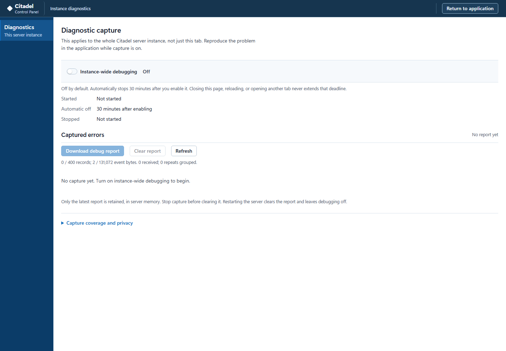

# Timed diagnostic capture

For troubleshooting, open **`/debug` on the same Citadel instance** and sign in
as its normal owner. This support page has no entry in the application menus.
The unlinked URL is not an access control: every diagnostic API also requires
the owner session and the normal browser transport checks.

## Capture a report for support

1. Open the exact `/debug` route, for example
   <http://127.0.0.1:4173/debug> for the local installation. Use the same host as
   the affected application, and sign in as its owner if prompted.
2. Turn on **Instance-wide debugging**. Check the displayed start and automatic
   off times. If a prior report exists, download it before confirming
   **Replace and start capture**.
3. Return to the application and reproduce the problem while capture is active.
   Allow up to five seconds for already-running signed-in browsers to discover
   the capture. Sleeping or disconnected tabs may not join in time.
4. Return to `/debug`, turn the switch off, and choose **Download debug report**.
   A stopped report is marked `final`; downloading before stopping produces a
   `snapshot`.
5. Share the downloaded JSON manually through your approved support channel.
   Preserve it before choosing **Clear report**, starting another capture or
   restarting the server.

This retained synthetic-instance capture shows the default state. The switch
enables real collection on this server and in connected signed-in application
tabs, not unrestricted console or framework logging. Closing the debug page
does not stop a live capture. Nothing is uploaded automatically.

If the page cannot read authoritative status, use **Refresh** and follow the
displayed error; do not assume capture is on. Delivery warnings or omissions
mean the report may be incomplete. An empty report means no errors were
recorded, not that the instance passed a health or security check.

For operators maintaining an older installation, see the
[source-version prerequisite](../README.md#start-with-a-clone). This support
route is part of the locally accepted `4379522c` application, not a promise
about older published images.

## The capture window

- Debugging starts **off**. Opening the page does not enable it.
- Enabling starts one fixed **30-minute** interval for this server process.
  Repeated ON requests, reloads, other tabs and application activity cannot
  renew it. The page need not remain open or focused.
- The server enforces the cutoff on its timer and on status, ingestion and
  report/download access. Elapsed monotonic time and wall time can each end the
  interval; moving either clock backwards cannot extend it.
- Turn the switch off to stop early. The latest bounded report remains in
  server memory and can still be read or downloaded. Clear requires a stopped
  capture. A new capture replaces the old report after an explicit UI warning.
- Restarting the server clears the report, signs browsers out through the
  normal owner flow, and leaves debugging off. There is no diagnostic file or
  resumable capture under `/data`.

A download while running is marked `snapshot`; after stopping it is `final`.
Final means the capture window is closed, **not** that every browser error was
observed. An empty report says no errors were recorded, not that a test passed.
The filename contains only a UTC start time and a random capture identifier,
never a workspace name, user, repository or source path.

## Coverage and useful detail

Server/API failures are observed at the HTTP response boundary, including
handled 4xx/5xx responses and prematurely closed application responses.
Diagnostics, diagnostic assets and the platform health probe are excluded to
prevent self-report loops. There are no fatal-process handlers that keep a
failed process alive.

The application bootstrap starts the browser observer after owner sign-in.
The shared local API and single-flight boundaries, main status/startup,
workspace catalog, migration, local-source import and Terraform export handlers
report structured errors. Standard `error` and `unhandledrejection` listeners
cover uncaught failures without preventing their normal browser behavior.
The diagnostic page's own failures appear on the page, not as new captured
application errors.

Running tabs poll every 5 seconds. A same-profile cross-tab notification prompts
an earlier authoritative poll; it never grants or renews capture by itself.
Other profiles normally activate within one polling interval **after the
server window has already started**. Tabs loaded before this feature was
installed need reloading. Browser timers may be throttled or suspended:
sleeping, offline, crashed or unavailable tabs can miss errors. A browser
stops collecting after 15 seconds without a fresh status response, and uses
both its monotonic and wall clocks to stop at the remaining server deadline.
No error is recovered retrospectively.

Browser records wait in a small queue and are normally sent after one second.
The server rejects late or old-capture batches, including errors queued before
stop but delivered afterwards. A failed send may already have arrived, so the
same batch is never retried. The page reports delivery/coverage warnings;
same-profile tabs exchange only finite warning codes bound to the capture.
It cannot learn about an entirely disconnected browser profile. Missing
batches that never reach the server cannot always be counted there.

The list shows errors before recognized informational browser probes, newest
first within each group. Fixed descriptions explain known error codes and HTTP
statuses and offer a suggested next step. A recognized optional favicon or
Chrome DevTools metadata request is identified as such; an unknown 404 stays
an unexplained error and is not discarded or declared harmless.

Known request methods and finite endpoint templates identify the operation
without its target values. For example, a workspace blob request can retain
`GET /api/github/workspaces/:environmentId/blob`, never the environment id,
file alias or query. A bundled asset is named only when it appears in the
checked-in allowlist. An unknown requested name is explicitly excluded.
These clues and the static advice are not a proven root-cause diagnosis.

Native workspace failures use the same boundaries. Their finite catalogs include
the shipped native modules, three local WASM assets, inventory endpoint template
and known parser/source/identity/recovery codes. Native file aliases, profile/unit
identities, input values, XML and dependency text are still excluded. A grammar
limitation such as an integer-mantissa HCL exponent is described as unsupported
editor syntax, not an invalid Terraform configuration.

## Privacy contract

Sanitization is construction from an allowlist, not a regex over raw logs.
It happens before any browser event is queued or sent, is checked again on
ingestion, and is checked on report/export and display. Unknown names/codes
become generic categories. Unknown posted fields and unsupported record values
are rejected, not copied. Every accepted string is a fixed vocabulary entry,
a server-generated capture/correlation identifier, or a server-generated UTC
timestamp. Numeric coordinates and counters are bounded.

There is no field for exception messages, stacks, raw URLs, queries, fragments,
request/response bodies, headers, cookies, session credentials, PATs, passwords,
API keys, source/configuration/parameter/policy/plan/state values, DOM or clipboard
text, usernames, email addresses, project/environment/repository labels,
absolute paths, arbitrary console text or screenshots. Sensitive values are
not hashed as a substitute for excluding them. No browser fingerprint or raw
User-Agent is collected. Owner authentication still uses the existing session
header for the same-origin request; that header is not diagnostic payload.

An uncaught error's location is retained only when its filename exactly
identifies a known bundled same-origin module, without query/fragment or URL
credentials. Stacks are never parsed. A handled-error hook may instead supply
a known **reporting module**, which is not a claim about the throw site.

The existing request/response correlation contract is preserved. A diagnostic
server record and the safe server error log use a newly server-generated UUID;
an inbound `X-Correlation-ID` is never captured or logged. Browser records do
not accept correlation identifiers. Diagnostics does not read, export, replace
or suppress normal browser console output.

This is a constrained diagnostic aid, not a source-state reproduction package
or a security certification. A compromised owner/browser can submit misleading
but schema-valid client records; `source: client` is not server attestation
that the described error really occurred.

## Exact schema, version 1

The catalogs in `shared/diagnostics.mjs` define every allowed method, operation,
application code, exception class, module and resource. Explanatory text comes
only from `shared/diagnostics-guidance.mjs`; it is derived for display and is
not a free-text field in the report. Build identity is deliberately not read
from process environment or private files; this version supplies the fixed
application and schema identifiers, not an inferred application revision.

The UTF-8 JSON document has exactly these top-level fields:

| Field | Value |
| --- | --- |
| `schemaVersion` | Integer `1` |
| `application` | Literal `citadel-ui` |
| `scope` | Literal `server-instance` |
| `kind` | `empty`, `snapshot` or `final` |
| `limits` | Exact constants listed below |
| `capture` | `null`, or the capture object below |
| `counts` | The counter object below |
| `events` | At most 400 event records below |

The capture object has exactly these fields:

| Field | Value |
| --- | --- |
| `id` | Server-generated random UUID v4; not an authentication capability |
| `startedAt`, `deadlineAt` | UTC ISO timestamps, exactly 1,800,000 ms apart |
| `active` | Boolean |
| `remainingMs` | Integer 0 through 1,800,000; zero after stop |
| `stoppedAt` | `null` while active; effective cutoff timestamp otherwise |
| `stopObservedAt` | `null` while active; server wall time when it observed stop |
| `stopReason` | `null` while active; `manual` or `expired` otherwise |

For delayed timer delivery or server sleep, `stoppedAt` is the fixed deadline
and `stopObservedAt` may be later. Event timestamps use the capture's elapsed
time anchored to its start, so a clock rollback cannot put later events before
earlier ones or renew the interval.

Each stored event has exactly these fields:

| Field | Value |
| --- | --- |
| `id` | Capture-local sequence, 1 through 400 |
| `source` | `server` or `client` |
| `category` | `request`, `handled`, `uncaught`, `unhandled-rejection` |
| `operation` | Exact `DIAGNOSTIC_OPERATIONS` key |
| `code` | Exact `DIAGNOSTIC_CODES` entry; otherwise `UNKNOWN` |
| `status` | HTTP integer 400 through 599, or `null` |
| `exception` | Exact `DIAGNOSTIC_EXCEPTIONS` entry; otherwise `UnknownError` |
| `method` | `GET`, `HEAD`, `POST`, `PUT`, `PATCH`, `DELETE`, `OPTIONS`, or `null` |
| `resource` | Exact `DIAGNOSTIC_RESOURCES` template/asset entry, or `null` |
| `module` | Exact `DIAGNOSTIC_MODULES` entry, or `null` |
| `line`, `column` | Integers 1..100000 and 1..10000, or `null`; both null without a module |
| `firstAt`, `lastAt` | Server-generated UTC ISO timestamps |
| `occurrences` | Positive integer; matching browser records are grouped |
| `correlationId` | Server-generated UUID v4 for server records; `null` for clients |

Counters have exactly these nonnegative, safe-integer fields:

| Field | Meaning |
| --- | --- |
| `received` | Valid, in-window event attempts, before event-rate/capacity limits |
| `stored` | Unique retained records |
| `deduplicated` | Additional occurrences grouped into retained browser records |
| `omitted` | `omittedByRate + omittedByCapacity` |
| `omittedByRate` | Event attempts exceeding the event/minute budget |
| `omittedByCapacity` | Event attempts exceeding record or serialized-event byte limits |
| `clientQueueOmitted` | Browser-reported queue/send losses; failed sends may already have arrived |
| `rejectedBatches` | Rejected diagnostic ingestion requests observed while active |
| `eventBytes` | UTF-8 bytes of the compact serialized `events` array, including brackets/commas |

Counters saturate at `Number.MAX_SAFE_INTEGER`. Browser loss counts are sent
in bounded chunks, at most 1000 per request. Counts are not unique incidents:
one failure can be observed by a server request, a client request, and a UI
handler. Server requests retain individual correlations instead of being grouped.

`limits` has exactly these fixed values:

| Key | Value |
| --- | --- |
| `durationMs` | 1800000 |
| `records` | 400 |
| `eventBytes` | 131072 |
| `bodyBytes` | 16384 |
| `batchEvents` | 20 |
| `clientQueueEvents` | 40 |
| `eventsPerMinute` | 600 |
| `ingestRequestsPerMinute` | 120 |
| `readRequestsPerMinute` | 240 |
| `downloadRequestsPerMinute` | 12 |
| `controlRequestsPerMinute` | 30 |
| `pollMs` | 5000 |
| `flushMs` | 1000 |
| `clientLeaseMs` | 15000 |

The record and byte limits bound retained memory; grouping indexes and
serialized snapshots are also bounded by those finite records. The displayed
event-byte count is not a claim about JavaScript heap overhead or the indented
download's byte size. Read/download/control/ingestion request budgets are
independent per-instance minute windows.

## Protected API contract

All paths below are beneath `/api/diagnostics`. No query string, CORS recipient,
TTL override, debug bypass or clock-control endpoint is accepted.

| Method and suffix | Input / output |
| --- | --- |
| `GET /status` | Exactly `{ capture, counts }`; no event records |
| `GET /report` | Complete validated report |
| `GET /download` | Validated JSON attachment, `Cache-Control: no-store` |
| `POST /capture` | Exactly `{ enabled: boolean, expectedCaptureId: UUID-or-null }`; returns state |
| `POST /clear` | Exactly `{ expectedCaptureId: UUID-or-null }`; returns state |
| `POST /events` | Exactly `{ captureId, events, clientQueueOmitted }`; returns `{ accepted, state }` |

An ingested client event contains exactly `category`, `operation`, `code`,
`status`, `exception`, `module`, `line`, `column`, `method` and `resource`.
The server supplies source, timestamps, record id and occurrence count; the
browser cannot post those fields. This fixed, shallow shape is the depth limit:
nested records or nested property values are refused, with a 16 KiB body cap
before JSON parsing and at most 20 records per batch.

Capture state changes are synchronous within the one server instance.
Duplicate ON returns the current active capture unchanged. Stale stop, clear
or replacement requests cannot alter a newer capture: they receive 409 and the
page refreshes before the user can retry. Unknown methods receive 405 with an
allowlist; unsupported fields, shapes and queries receive 400. Request-budget
exhaustion receives 429. These failures do not create recursive diagnostic events.
