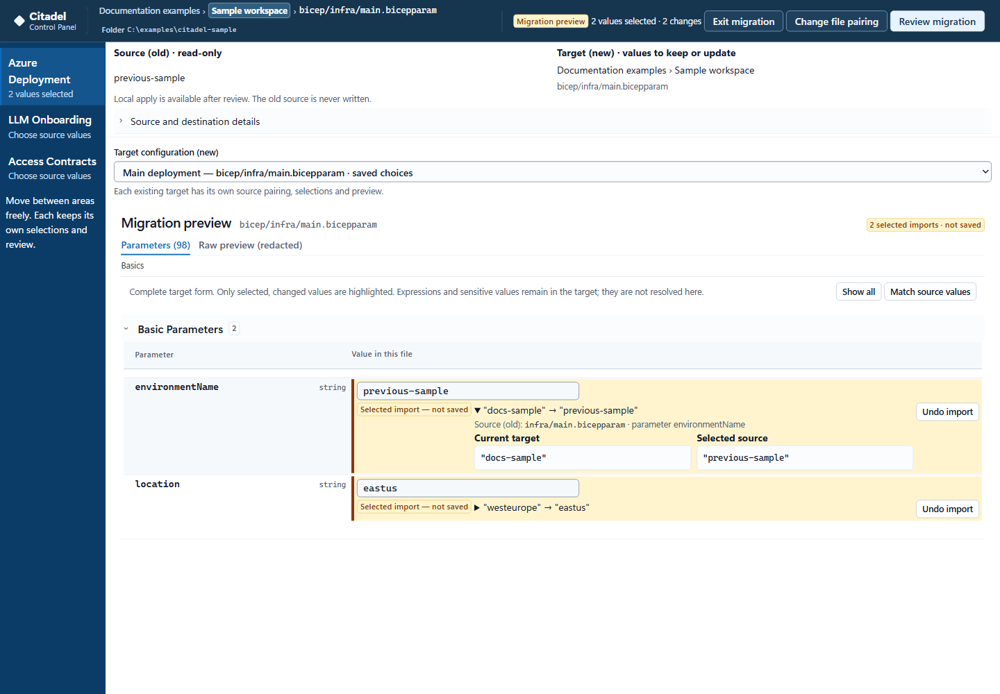

# Citadel Control Plane

The configuration surface for the Citadel AI Hub Gateway.

---

## Start with a clone

Clone **main** of this repository. These instructions deploy **Citadel UI only**;
they do not use sample branches or deploy the gateway.

```text
git clone --branch main --single-branch https://github.com/taomar/citadelUI-github.git
cd citadelUI-github
```

The application and its deployment live in **`CitadelUI/`**. Never run `azd up`
at the repository root: its `azure.yaml` belongs to the gateway.

## Run locally

Install Docker Desktop or Docker Engine 29+ with Compose, start Docker, and use
Microsoft Edge or Google Chrome. Choose one of these two paths from the cloned
repository:

### PowerShell

```powershell
Set-Location .\CitadelUI
if (-not (Test-Path container.env)) { Copy-Item container.env.example container.env }
.\scripts\start.ps1
```

### Bash

```bash
cd CitadelUI
if [ ! -f container.env ]; then cp container.env.example container.env; fi
# Linux Docker Engine: give the container's non-root user its data directory.
if [ "$(uname -s)" = "Linux" ]; then
  sudo install -d -m 0700 -o 10001 -g 10001 .data
fi
bash scripts/start.sh
```

Both launchers build the image, start the same container, and wait for it to be
healthy. Open <http://127.0.0.1:4173> and create the container's owner account.
Keep port **4173**: local folder permissions are tied to that exact browser
origin. State is stored in `CitadelUI/.data` by default; for a custom
`CITADEL_DATA_PATH`, prepare that directory instead.

For an existing installation, follow the
[local image-only update procedure](./guides/deployment.md#update-an-existing-local-container)
to activate an already built image without rebuilding from another checkout.
Keep the original Compose configuration, data directory and browser origin.

## Deploy to Azure

Choose a path below. Edit **`CitadelUI/infra/main.bicepparam`** for deployment
settings; azd reads it and the hook synchronizes inputs into its environment.
Each linked section starts from a fresh clone and ends at the deployed app. Azure
examples use PowerShell 7.4+, Azure CLI and, where provisioning is needed, Azure
Developer CLI (`azd`). Images are built in Azure Container Registry; no local
Docker daemon is needed for Azure deployment.

| Deployment path | Complete commands |
| --- | --- |
| Fresh Azure deployment behind a new VNet | [Scenario 1: private mode](./guides/deployment.md#fresh-azure-deployment) |
| Fresh Azure deployment on a public endpoint | [Scenario 1: public mode](./guides/deployment.md#fresh-azure-deployment) |
| Deployment on an existing subnet and existing resources | [Reuse named resources; create anything unnamed](./guides/deployment.md#deploy-on-an-existing-subnet-and-resources) |
| Local deployment through PowerShell | [Complete PowerShell commands](./guides/deployment.md#local-deployment---powershell) |
| Local deployment through Bash | [Complete Bash commands](./guides/deployment.md#local-deployment---bash) |

**Create or reuse:** Container Apps, VNet/subnet, Azure Container Registry, Key
Vault, Log Analytics, storage/Azure Files and managed identity support existing
resources. Leave existing-resource selectors empty to create the defaults.
A reused Container Apps environment keeps its own network and logging settings.

All Azure paths use Citadel UI's **owner sign-in**, with the credential-encryption
secret retained in **Key Vault**. The deployment creates the key only when absent
and never replaces it during a normal redeployment.

For an already configured UI container app, use
[image-only redeployment](./guides/deployment.md#redeploy-an-existing-citadel-ui-container-app)
to preserve its mounts, identity, network and owner state. None of these paths
deploys the gateway or sample applications.

Fresh public deployment and the native parameter-file workflow passed live
`azd up` tests. Protected-resource reuse also passed live private DNS, sign-in,
storage, Key Vault and log-query checks, including a repeat deployment with
unchanged shared settings and retained owner/data/key state. The azd hook
preserves or initializes the Key Vault key before image deployment.

Private endpoints require an in-network build/deployment host. The guide's
temporary VM is for isolated staging/testing, **not the Citadel UI runtime**;
an existing connected workstation or private CI runner can serve that role.

---

## Overview

Citadel Control Plane is a containerised, browser-based editor for the declarative
configuration of a Citadel AI Hub Gateway deployment. It presents Bicep parameter
files and their associated API Management policy documents as explained forms, and
writes surgical changes that leave unrelated comments and formatting untouched.

Workspace setup offers **Existing GitHub Repo**, **New GitHub Repo**, and **Local**.
New GitHub Repo can initialize a private repository from the upstream `citadel-v1`
snapshot (or an overridden GitHub source), then continue through the same
repository and branch selection. Its temporary creation token requires more
access than the normal editor token; the inline help explains that distinction.

After opening a destination workspace, **Migrate Citadel Configuration** can
compare older local, public GitHub, or private GitHub parameters against its
current templates. It proposes values only for current parameter names, reports
unmatched names per file pair, and requires review before applying changes to a
local destination. GitHub destinations support preview and sanitized export only.
See [configuration migration](./guides/using-the-control-plane.md#migrate-citadel-configuration).

It is an operations tool, not a gateway runtime component. It does not deploy the
gateway, send application telemetry, or check for updates. When hosted on Azure,
its managed identity can read a credential-encryption key from Key Vault; the
local default needs no Azure access. The gateway it configures is deployed by
the accelerator's own pipeline, exactly as before.

## How it completes the Citadel AI Hub

The [Citadel AI Hub Gateway](https://github.com/mohamedsaif/ai-hub-gateway-solution-accelerator/tree/citadel-v1)
is contract-driven. The model backends behind the gateway, the products and
subscriptions that grant access to them, and the policies that constrain them are
all declared as files in the repository and then deployed. That design is what
makes the gateway reviewable, reproducible and auditable.

It also means day-to-day operation is editing Bicep parameter files and API
Management policy XML by hand, in a repository where a misplaced comma in an
untyped array, or a parameter removed because its purpose was not obvious, is not
caught until a deployment fails or a policy silently stops applying.

The Control Plane is the interface over exactly those artefacts. It reads the
banner comments the files already carry and renders them as guidance, so the
explanation beside a field is the repository's own rather than a second copy that
drifts. It validates across files, not just within them. And every write is a
verified transaction: back up, write, verify hashes, restore on failure.

| Gateway concern | Declared in | Control Plane surface |
| --- | --- | --- |
| Hub infrastructure, networking, feature flags | `bicep/infra/main.bicepparam` | Azure Deployment |
| Model backends behind the gateway | `llm-backend-onboarding/main.bicepparam` | LLM Onboarding |
| Products, subscriptions and per-use-case policy | Access contract folders | Access Contracts |

The accelerator defines and deploys the runtime. The Control Plane is how its
configuration is operated between deployments.

## What it edits

The browser traverses only a directory or repository the operator selects, and the
scope is limited to `.bicepparam` files, the Bicep templates those parameters refer
to for schema, and the API Management policy XML belonging to an access contract.
Generated and unrelated directories are ignored.

The explicit New GitHub Repo initialization step copies the complete checked-in
source snapshot, including binary assets and licenses, only into its newly
created private repository. This does not widen the normal editor's file scope.

Repository access is granted by the browser through the File System Access API, or
by a GitHub token scoped to the repositories it should reach. The container
receives no source mount, no Docker socket, no operator cloud credential and no broad host
filesystem access.

## What it looks like

These desktop screenshots use synthetic examples, zero subscription IDs and
reserved `example.invalid` endpoints, not deployed environments.

Feature flags decide which capabilities the hub deploys at all. Turning one off
does not merely hide it: the resources behind it are not created, and the
parameters belonging only to it stop being asked for.


Address planning is checked against Azure's rules rather than a regular
expression. Overlapping subnets are named on both fields and block the save.


`llmBackendConfig` is an untyped array in Bicep, so the compiler cannot help and
neither can a generic form. It gets a purpose-built editor covering every
supported provider, with credential handling that follows the provider.


Access contract policies are presented as the blocks they are made of, each one
switchable, with the raw XML always a click away. A model allowed here but never
onboarded is flagged by name.


Migration uses the same typed target form. Only selected, changed values are
highlighted with their source and **Undo import**; matching starts with
differences and filters names as you type. This example uses **Show imported**
to focus on two choices that have not been saved.



## Guides

- [Deployment guide](./guides/deployment.md) — running on Azure, running locally,
  and the choices available during deployment.
- [Using Citadel Control Plane](./guides/using-the-control-plane.md) — workspaces,
  configuration migration, the three editing areas, validation, and how saves
  are made.

## Reference

Detailed reference for the application itself is kept with it:
[`CitadelUI/README.md`](./CitadelUI/README.md),
[`CitadelUI/SECURITY.md`](./CitadelUI/SECURITY.md) and
[`CitadelUI/BACKUP-RECOVERY.md`](./CitadelUI/BACKUP-RECOVERY.md).

## License

See [LICENSE](./LICENSE).
