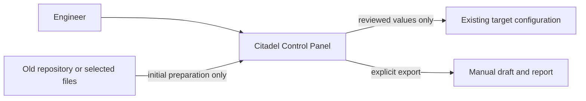
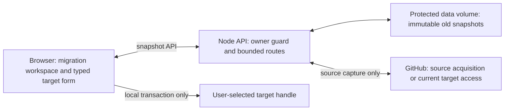
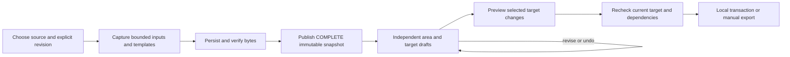

# Citadel migration: successor handover

Prepared 2026-09-08 from the local checkout and the work recorded in this session.

**Read this before changing or restarting anything.** The implementation is committed locally, the latest image is running, and no push or merge has been performed. This document records both the delivered system and the mistakes made getting there. It is not a request for another redesign or modernization project.

## Archive-safe starting point

The user intends to archive this session and all its worker sessions. **Do not rely on their worktree paths, session links, or session-state files continuing to be directly accessible.**

The durable handover bundle is:

```text
C:\Users\tarekomar\.copilot\handoffs\citadel-migration-2026-09-08
```

Read `START-HERE.txt`, then this `HANDOVER.md`. The bundle contains copied reviews, receipts, screenshots, an offline public-source fixture and a SHA-256 manifest. None of these copies depends on restoring an archived session. It deliberately contains **no production `/data`, owner credentials, PATs, browser handles or private source snapshots**.

The committed application is preserved in the normal project repository under the stable local branch:

```text
handover/citadel-migration-2026-09-08
```

It contains application commit `1684b42b3c6e4382fb76b88772ea25d18d9f7f4a` plus the documentation-only handover commit. `runtime-and-git.json` records its exact final HEAD. Create the successor's app session in **`taomar/citadelUI-github` based on that local branch**, not the older `main` or the separate `taomar/Citadel-UI` project. The committed handover is `guides\migration-successor-handover.md` in that checkout.

`code\citadel-migration-handover.bundle` is an additional local Git recovery copy of the completed change and handover. It is an **incremental bundle requiring base `6bbf17e60dea0bf3c988aa327c8d2e9a68fc9484`**, which exists in the retained project repository; it is not a standalone copy of all upstream history. `runtime-and-git.json` records the source, image and mount identity, and `manifest.json` records artifact hashes and original provenance.

Session archival does not itself update the canonical checkout's older `main`. It also must not remove the normal project repository, Docker images or persistent application data.

## Part 1 - Technical state and operational handover

### 1. Start here: the repositories are not interchangeable

| Item | State at handover |
|---|---|
| Actual application repository | `taomar/citadelUI-github` |
| Historical implementation checkout | `C:\Users\tarekomar\.copilot\repos\copilot-worktrees\citadelUI-github\taomar-cuddly-disco`; may be removed by archival |
| Application source directory | That checkout's `CitadelUI` directory |
| Local implementation branch | `taomar-private-import-token-helper` |
| Completed local commit | `1684b42b3c6e4382fb76b88772ea25d18d9f7f4a` |
| Commit subject | `Make migration offline and easier to review` |
| Commit scope | 59 files; includes the cumulative migration, snapshot, model review, source preparation, token helper, progress, settings and header work |
| Worktree | Clean immediately after commit and when preparing this handover |
| Push/merge | Neither was performed |
| Archive-safe local source branch | `handover/citadel-migration-2026-09-08`, containing the completed application and handover commits |
| Separate canonical app checkout | `C:\Users\tarekomar\.copilot\repos\citadelUI-github` |
| Canonical checkout's current branch/commit | `main`, `6bbf17e` at handover; it does **not** contain the new local branch commit |
| This conversation's configured repository | `taomar/Citadel-UI`, a different repository |
| This conversation's checkout | `C:\Users\tarekomar\.copilot\repos\copilot-worktrees\Citadel-UI\taomar-congenial-funicular` |
| This conversation's actual Git branch | `taomar-local-docker-container` |

Do not put application fixes into the conversation's `Citadel-UI` checkout just because it is the default working directory. Do not build the canonical app checkout's older `main` and call it the latest implementation. These distinctions caused real confusion in this session.

The application is a containerized, mostly dependency-free JavaScript editor for user-selected Citadel repositories. It renders Bicep parameter files and associated policy configuration as forms, preserving unrelated source formatting during actual writes. The repository also contains accelerator configuration that the app edits; those files are product data, not the application's implementation.[^repo-scope][^readme]

### 2. Runtime that must be preserved

| Item | Value |
|---|---|
| User URL | `http://127.0.0.1:4173/` |
| Container | `citadel-ui-app-1` |
| Current container ID | `6de11317468295a364106895ef728b831805e5cc5b8ac31eb0961ad927274958` |
| Current image ID | `sha256:eee6b78a14e38e0527f31c6ba4670f99369b59e66ff805f0d33550cb54e2c70e` |
| Stable image tag | `citadel-ui:source-step-46eeca6f-7869e45447b5` |
| Mutable local tag | `citadel-ui:local`, pointing to the same image |
| Complete application source digest | `7869e45447b5a3e2274663f5887f03178a25e4415422a03c90aa2215bc76c0a8` |
| Published port | `127.0.0.1:4173` to container `4173` |
| Persistent host data | `C:\Users\tarekomar\.copilot\repos\citadelUI-github\CitadelUI\.data` |
| Container data location | `/data` |
| Canonical Compose file | `C:\Users\tarekomar\.copilot\repos\citadelUI-github\CitadelUI\compose.yaml` |
| Immediate previous image | `sha256:6d84af8b43e0338b2b002d1a1c5330f01103df2d7edb60c9c9b5cbfc6e4cd6e9` |
| Immediate rollback tag | `citadel-ui:rollback-46eeca6f-6d84af8b43e0` |

The container was healthy at handover. Runtime details were read using targeted Docker inspection, without reading credentials.

**Image/commit distinction:** the image was built before the final Git commit. Its `org.opencontainers.image.revision` label still identifies base commit `6bbf17e`; its separate source-digest label identifies the built application bytes. Committing did not change those bytes. Do not mistake the older revision label alone for proof that the running source is stale.

The normal `scripts\start.ps1` command performs `up --build`. Running it from the canonical checkout would rebuild that checkout's older source. During this session, images were built from the implementation worktree and activated through canonical Compose with `--no-build`, preserving the existing data mount.[^start][^compose]

Do not change the origin casually. `localhost` is not interchangeable with `127.0.0.1` under the application's Host checks, and browser directory permissions/IndexedDB state are origin-bound.[^readme][^owner]

### 3. Detected stack and directory boundaries

| Layer | Technology | Local evidence |
|---|---|---|
| Browser UI | Native ES modules and DOM helpers; existing typed parameter/model renderers | `CitadelUI\web\index.html`; `web\js\app.mjs`; `web\js\paramview.mjs` |
| API/server | Node.js ES modules and built-in HTTP/filesystem/crypto APIs | `CitadelUI\server\index.mjs`; `server\migration-snapshots.mjs` |
| Parsing/editing | Shared Bicep AST/literal readers and surgical edit operations | `CitadelUI\shared\bicepparam`; `shared\parameter-migration.mjs` |
| Browser persistence | Registry and File System Access handles, including target-root proof | `CitadelUI\web\js\registry.mjs`; `directory-provider.mjs` |
| Container persistence | Private files under `/data`, including snapshots and transaction data | `server\migration-snapshots.mjs`; `server\transactions.mjs` |
| Packaging | Docker/Compose; no app `package.json`, lockfile or npm installation step | `CitadelUI\Dockerfile`; `CitadelUI\azure.yaml:49-58`; `AGENTS.md:35-47` |
| Tests | Existing `node --test` suites, isolated HTTP apps, synthetic browser handles and native browser scenarios | `CitadelUI\test`; acceptance artifacts in section 11 |
| Host Node observed | `v24.10.0` | Local `node --version` at handover |
| Runtime Node pin | Node `22.14.0`, Bookworm slim, pinned digest | `CitadelUI\Dockerfile:2`; `compose.yaml:10` |
| License | MIT | `LICENSE:1` |

Important directories:

| Path relative to app repository | Responsibility |
|---|---|
| `CitadelUI\server` | Application HTTP, owner/session boundaries, storage and GitHub adapters |
| `CitadelUI\shared` | Parsers, migration values/model decisions, source limits and contracts |
| `CitadelUI\web` | Main editor, migration mode, source preparation and target preview |
| `CitadelUI\test` | Existing automated tests and isolated fixtures |
| `CitadelUI\scripts`, `CitadelUI\infra`, `CitadelUI\azure.yaml` | Application launch/deployment tooling; not changed into a new cloud deployment in this session |
| Root `bicep`, `src`, `shared`, `azure.yaml`, `.env.template` | Accelerator/product configuration; do not restructure as app code |
| `CitadelSamples` | Separate experimental application; not part of this recovery |
| `guides`, `docs` | Operator documentation and images |

The root `azure.yaml` describes a different product. Running root-level `azd up` is not how to update this UI. No Azure provisioning was requested or performed in this recovery.[^repo-scope][^azd]

### 4. Commands and verification inventory

Run application commands from the successor checkout's `CitadelUI` directory, after creating it from the preserved local branch. Do not use this conversation's default checkout or an archived worktree path.

```powershell
$AppRoot = (git rev-parse --show-toplevel).Trim()
git -C $AppRoot merge-base --is-ancestor 1684b42b3c6e4382fb76b88772ea25d18d9f7f4a HEAD
if ($LASTEXITCODE -ne 0) { throw 'Start from the preserved migration handover branch first.' }
Set-Location (Join-Path $AppRoot 'CitadelUI')
```

| Command | Purpose / qualification |
|---|---|
| `git -C $AppRoot status --short` and `git -C $AppRoot log -1` | Establish current local work and commit before editing |
| `node --test --test-reporter=spec .\test\migration-target-preview.test.mjs .\test\migration-wizard.test.mjs` | Targeted source/UI/review-transition coverage; used during the latest fix |
| `node --test --test-reporter=spec .\test\migration-snapshots.test.mjs .\test\migration-session.test.mjs .\test\llm-value-migration.test.mjs .\test\migration-core.test.mjs` | Storage, restart, value matching, model isolation and target safety |
| `node --test "test/*.test.mjs"` | Repository-documented broad run; known unrelated failures exist, so do not claim a universal green gate |
| `node --check .\web\js\migration-wizard.mjs` | Targeted syntax check |
| `node .\tools\contrast.mjs` | Existing contrast utility, when changing relevant colors |
| `git -C $AppRoot diff --check` | Whitespace check; not a behavior test |
| `docker build --tag <new-local-tag> .` | Build from the verified app directory; Dockerfile supplies the pinned default Node base |
| `.\scripts\start.ps1` | Normal local start/build; **dangerous from the stale canonical checkout** in this machine's present arrangement |
| `docker inspect citadel-ui-app-1` | Runtime identity; restrict output to needed fields rather than dumping credentials/environment |
| `Invoke-WebRequest -UseBasicParsing http://127.0.0.1:4173/healthz` | Read-only liveness; does not prove a usable migration journey |

Use `node --test`, not `node some-test-file.mjs`. The runner establishes test context, and the server requires isolated test data roots.[^tests][^test-guard]

One exact-public-cache test is opt-in. To enable it without reacquiring GitHub data:

```powershell
$env:CITADEL_MIGRATION_PUBLIC_CACHE =
  'C:\Users\tarekomar\.copilot\handoffs\citadel-migration-2026-09-08\fixtures\public-main-offline.json'
node --test --test-reporter=spec .\test\migration-snapshots.test.mjs
```

The original session fixture lacked three referenced template blobs. The archive-safe fixture includes the exact required local Git blobs, hash-verified rather than substituted from current-file bytes. Its verification log is copied into the bundle. Do not silently download replacements or fabricate fixture content.[^cache-test]

No dedicated app lint/format/typecheck package scripts were found; do not invent npm commands for this zero-package app. The tracked `.azdo\pipelines\azure-dev.yml` runs azd provisioning/deployment on pushes to `main`; it is not evidence of an enforced migration test gate. No tracked GitHub Actions workflow was found. Branch-protection/required-check enforcement is **[UNVERIFIED]**; no remote administrative inspection was performed.[^ci]

**Runtime surface and drift:** Dockerfile and Compose pin the same Node 22 image; local tests were run on host Node 24, so image startup and actual served-file checks matter. Azure application packaging also points to this Dockerfile. The root pipeline uses `ubuntu-latest`, not a pinned UI Node test version. Runtime EOL/vulnerability freshness was **not audited** in this task; a digest pin is not a security endorsement.[^docker][^compose][^azd][^ci]

## Part 2 - Product contract, context, and lessons

### 5. What the user actually asked for

The user repeatedly clarified the following. Treat these as the product contract, not optional polish:

1. Import **selected old values into matching existing new parameters**. The new environment defines the targets. Do not import old parameter definitions or translate every legacy Bicep version.
2. Use the familiar **main-page editor layout**, explicitly labelled **Migration preview**: area sidebar, section navigation, typed inputs, object tables, feature toggles and model forms.
3. Populate the projected target with selected values and highlight only actual changed imports as **not saved**. Show original value, source provenance and **Undo import** at the change.
4. Keep Deployments, LLM Onboarding and Access Contracts navigable without destructive switch popups. Each area and each existing target configuration keeps its own draft.
5. Hide proven identical values from the default matching worklist; retain an optional full/identical view. A complete target-form preview may show unchanged fields, but they must not be highlighted as imports.
6. Match models only inside an explicitly paired backend. Never use array position, lossy ID normalization, global model-name grouping, or catalogue resemblance.
7. Capture the old source once into a durable, private, immutable offline copy. Review must not depend on the old GitHub branch, PAT lifetime or original folder staying available.
8. Keep next actions local to the task. The latest source step is **Find repository -> explicitly select revision -> Prepare source and continue** beside the fields, not an obscure header-only action.
9. Let users revise, skip, undo, discard and finish with no changes. Never call something copied before a successful transaction.

Local targets can apply reviewed changes through the existing transaction path. GitHub targets remain preview/export-only. That limit must stay visible; the main-page presentation must not accidentally call the ordinary editor's save or subscription/environment actions.

### 6. Mistakes I made and what a successor must avoid

These are my failures during this work, not blame assigned to the user.

| What I did wrong | Why it hurt | Required replacement practice |
|---|---|---|
| Started in the conversation's repository without establishing which checkout produced the app | Changes, screenshots and running behavior referred to different repositories/images | Establish repository, branch, commit, image and data mount first. Record all five. |
| Gave permission advice from a flattened error before obtaining the actual failure | The user changed tokens repeatedly and the real failing request remained hidden | Diagnose request/status/required permission safely. Consult authoritative endpoint documentation; do not guess or request a PAT in chat. |
| Asked for more screenshots when the provided evidence/documentation was enough | Added friction and made the user do the investigation | Use existing screenshots, supplied URLs and code first. Ask only a precise question that changes the fix. |
| Treated commit pinning and a memory LRU as an offline source | Reviews still called GitHub and failed on quota/auth changes | Separate initial acquisition from an immutable durable source adapter. Prove original-source counters stay flat after capture. |
| Fixed cross-area mixing by disabling LLM, then by adding a destructive confirmation popup | Prevented the user's navigation rather than representing independent work | Preserve distinct area/target drafts; ordinary navigation must not delete them. |
| Compared display strings or treated missing data as equality | Different long values could appear identical; target-only model fields were counted as same | Compare full validated literals. Distinguish same, different, target-only, unmatched and unresolved facts. |
| Presented a large generic parameter/JSON report instead of the familiar editor | The user could not see the target, the old values, or what would change | Reuse the actual target renderer. Keep mapping details secondary and highlight real selected changes in place. |
| Put the continuation only in the distant top bar | The user successfully found a repository but perceived a dead end | Put the next action beside the controlling inputs, explain readiness, and test find/select/prepare visually. |
| Let dropdown edits mutate committed review state too early | Unconfirmed backend proposals erased choices; Review-to-edit could crash | Separate proposed and committed state. Committed changes revoke review authority and enter a valid editable state before rendering. |
| Used whole-deployment readiness as an indiscriminate import blocker | Unrelated retained expressions prevented independent valid patches | Keep selected-value/dependency/target-integrity blockers; report unrelated pre-existing findings honestly without claiming deployment certification. |
| Cited many passing tests as if they proved the user's journey | Some tests explicitly enforced rejected behavior; simple fixtures missed realistic paths | Define acceptance from user intent, prove the actual missing transition, and use real-shaped fixtures in continuous native journeys. |
| Released successive partial fixes and repeatedly declared completion | The user encountered the next architectural problem after every restart | Stop partial recovery releases. Freeze one coherent candidate and keep readiness, acceptance and deployment as separate states. |
| Repeated status/wait messages and excessive coordination | Consumed time without advancing the critical path | One writer, a small number of concrete milestones, and a final handoff notification. Parallelize only genuinely independent work. |
| Built ad hoc preview transports with incorrect JSON/binary handling | Fixture-only failures wasted time and could be mistaken for product failures | Reuse the real request contracts. Distinguish metadata byte counts from byte arrays, set JSON content types correctly, and identify fixture defects explicitly. |
| Initially sanitized a normal section title as Basic-auth material | The UI literally showed a withheld section heading | Use safe metadata categories/known section labels. Redaction is essential, but indiscriminate text filtering can destroy usability. |

Do not repeat the most expensive pattern: **patch a screenshot, count green tests, deploy, then discover the user's real task still is not represented.**

### 7. Development and operating gotchas

- `AGENTS.md` documents `**/test` ignore inheritance. Verify new tests are actually tracked; a passing local untracked fixture is not part of a commit.[^repo-scope]
- The committed work is on a local feature branch, not `main`. A push of `main` would not publish it. The user requested **local commit only**; do not push, merge, or open a PR without a new request.
- A raw remote URL or full Docker environment dump can contain credentials. Prefer targeted metadata and redact before writing a handover.
- GitHub classic tokens are not the default app policy. Creating a private repository and filling it are different permissions; a Contents-only editing token is not automatically a creation token.
- The local owner session is reset by a container restart. GitHub destination connections were session-only in this runtime because no credential key was mounted. Reconnection after restart is expected, not proof of another authorization bug.[^owner]
- Completed source snapshots survive restart; **pending UI drafts are not promised durable across a browser reload or closing the migration session**. Navigation preservation and persistent source storage are different guarantees.
- All paths in operational commands here are Windows paths. Use PowerShell syntax supported by the environment; avoid assuming Bash chaining or native Unix tools.
- During preview debugging, one Playwright `check()` expected an immediate checked state although the then-current UI opened a confirmation first. That was not evidence of a broken checkbox. Conversely, a real product exception must not be dismissed as a tool issue.
- The final isolated source-form fixture had two genuine fixture defects: browser string bodies defaulted to `text/plain`, and a numeric metadata `bytes` count was mistaken for binary content. They were corrected only in the temporary fixture; production guards were not relaxed. The final source journey was then rerun successfully.
- Known unrelated broad-suite issues include the documented `primary-editors` failure and external-path assumptions in `supplied-repositories`. `AGENTS.md` also documents a connection-profile flake. Do not quietly change those to make this migration work look green.[^tests]
- Do not use root-level Azure deployment commands for a local UI fix. The app-specific deployment project is `CitadelUI\azure.yaml`.[^azd]

## Part 3 - Architecture and recovery blueprint

### 8. System boundaries





This diagram describes migration boundaries. The ordinary GitHub editor has its own write path; migration must not borrow that path merely because the target connection can push.



#### Snapshot subsystem

`MigrationSnapshots.capture()` reads supported old inputs and needed templates, proves separation while original source identities are available, stages bounded metadata and binary bodies, then completes and reopens a snapshot. The persistent adapter reads stored bytes and validates hashes; its freshness check validates the stored manifest, not the moving old GitHub ref.[^snapshot-client][^snapshot-store]

Storage is under `/data/migration-sources`. Current limits include 8 snapshots, 256 files per snapshot, 8 MiB per file, 64 MiB per snapshot, 256 MiB total and 1 MiB metadata. Read the constants rather than scattering copies of those numbers into new code.[^snapshot-contract]

Only complete, verified snapshots are usable. Partial/corrupt/missing data is an explicit failure, never an empty success or a reason to silently fetch upstream. Explicit refresh creates a new source identity and must preserve the previous complete source/drafts if acquisition fails.

Prepared configuration is sensitive runtime data, **not guaranteed credential-free** and not newly encrypted. The store rejects credential containers and certain explicit credential material, but arbitrary comments/configuration can still be sensitive. Owner access, private filesystem permissions, no secrets in logs/manifests, bounded storage and explicit deletion remain important. Upstream access revocation cannot retroactively erase an intentionally downloaded offline copy.[^snapshot-store][^snapshot-contract]

For local inputs, the browser retains proof of the original target root separately. Losing that proof or replacing the target root requires explicit reacquisition; a fresh cache ID by itself does not prove source/target separation.

#### Draft, model and typed-preview subsystem

`MigrationSession` owns target identity, source bindings, decisions, preview authority and local apply. The wizard's `reviewState()`, `selectArea()` and `selectTarget()` preserve independent drafts. Source capture failures and current-target failures are different error domains.[^session][^wizard]

`buildMigrationPlan()` exposes only actual new-file assignments as editable targets. Old-only and schema-only names remain reportable but cannot become new top-level parameters. Literal matching is exact and case-insensitive for Bicep identifiers, retaining target spelling.[^values]

`llm-value-migration.mjs` requires explicit backend pairing and matches model identity only within that backend. Reviewed model fields become granular `set` or permitted optional-property operations. New backend identity, endpoints, auth/routing, order, target-only models and unselected fields remain intact. No automatic backend/model additions or deletions are implemented.[^models]

`migration-target-preview.mjs` reuses the main `renderParamDocument()` and section navigation. This is a projection of reviewed choices, not the normal editor save surface. Highlights show selected changed values as not saved; per-field Undo changes the migration decision. Subscription/environment-save controls and ordinary save shortcuts must remain isolated.[^preview]

**Critical state-machine lesson:** opening general source matching from Review must enter editing. A committed matching mutation clears the preview and sets an editable step before rendering. `run()` must protect its initial render with the same failure/finally lifecycle that releases `busy`. The independent reviewer reproduced this exact missing transition and blocked the first candidate until it was fixed.

#### Cross-cutting concerns

| Concern | Location / rule |
|---|---|
| Owner authentication and request origin | `server\index.mjs:217`; `/healthz` is separate liveness, not owner access |
| Bounded snapshot API | `server\index.mjs:513`; `shared\migration-snapshot.mjs:5` |
| Filesystem integrity/publication | `server\migration-snapshots.mjs`; existing atomic helpers |
| Source adapter and provenance | `web\js\migration-snapshot.mjs`; immutable manifest and file hashes |
| Parameter/model validation | `shared\parameter-migration.mjs`; `web\js\migration-validation.mjs` |
| UI versus committed decisions | `web\js\migration-wizard.mjs`; backend proposal must not mutate confirmed pair |
| Local apply, backup and rollback | `web\js\mutation-coordinator.mjs`; `transaction-client.mjs`; `server\transactions.mjs` |
| Browser target proof | `web\js\registry.mjs`; never substitute alleged host paths |
| Logs and observability | Local progress/errors and evidence; no new telemetry service was introduced |
| Deployment | Existing Docker/Compose and app-specific Azure tooling; no source data is baked into images |

### 9. Intentional limitations: do not disguise them as success

- A Bicep expression is not a resolved environment value. No arbitrary Bicep/function/environment evaluation was added. Do not use a fallback literal, `nodeToValue()` expression object, or equal withheld text as proof of a previous/current runtime value.
- The inspected old public main file has 97 assignments, 93 expression-containing; old resources has 96/92. That is evidence about those repository files, **not** the user's actual deployed environment. A resolved literal `.bicepparam` or strict ARM deployment-parameters file is the safe source for unavailable values.
- Sensitive or unresolved LLM structures can remain withheld. Do not recover them from truncated display strings or allow a whole-array fallback import.
- Target dependencies required to validate a selected patch still matter. Unrelated retained findings are not blanket deployment certification and should not block an independent safe change without a justified dependency.
- GitHub targets remain preview/export-only. Their **current-target** freshness can require network access even though the old source is offline.
- Source snapshots persist; they do not imply indefinite preservation of every in-memory UI review.
- Prepared data is retained until explicit deletion and bounded by the store. No new encryption layer or retroactive upstream-revocation mechanism is claimed.
- No cloud deployment, remote merge or push occurred during this handover's implementation work.

### 10. Release discipline for the next change

Use the current architecture. Do not start by redesigning another screen.

1. Reproduce the actual reported journey using the correct running image and source identity. Separate missing affordance, a real exception, missing input and expected capability limits.
2. Keep one implementation writer. If another visible session owns the source, obtain a stopped/released handoff before writing. Use the independent reviewer read-only, not as a competing writer.
3. Add a regression for the exact missing transition before declaring it fixed. Include realistic Deployment, LLM and multiple Access target data; a `Count` field everywhere does not prove model review.
4. Freeze the actual tracked **and untracked** file set. Tie the test evidence, source hashes and candidate image to that same set.
5. Run a native continuous journey. Do not count hidden/closed disclosure text as visible guidance. Do not reset the page between interactions to hide state loss.
6. Prove acquisition happens once. Disable all original-source reads after completion, revoke mock credentials, move mock branches, deny original handles and restart an isolated app. Review must keep using the completed snapshot.
7. Exercise Review -> Match source values -> revise directly, with matching already expanded as well as newly opened. Cover scalar, model-field and confirmed-backend changes; require fresh review before apply/export.
8. Exercise one changed target, two Access target drafts, no-op, unknown match, target read failure, failed source refresh, per-field Undo, draft discard, exit Cancel/confirm and backup/receipt failure.
9. Validate the candidate on isolated runtime data. Verify the user URL serves the intended module hashes after activation. Liveness alone is insufficient.
10. Preserve the original data mount and a known rollback image. Do not remove volumes, reset the owner, rotate keys, kill unrelated processes or rebuild from stale `main` to make a deployment succeed.

A native source-setup journey must specifically include **Find repository -> choose branch -> Prepare source and continue -> configuration selection**. The latest complaint existed because finding the next header action was not obvious, even though the underlying capture route was functional.

### 11. Evidence and ownership map

All paths in this table are relative to the archive-safe bundle directory. The manifest preserves their original session provenance; session links are not required to open them.

| Artifact | Meaning |
|---|---|
| `receipts\latest-source.json` | Latest cumulative source receipt before local commit; matches the current deployed bytes |
| `receipts\recovery-corrected.json` | Independently accepted core recovery plus focused Review-to-edit correction |
| `reviews\recovery-review.md` | Initial independent diagnosis: source/state contract, test-oracle failures and recovery plan |
| `reviews\acceptance-rejected.md` | First final candidate **rejected** for the reproduced review/edit crash |
| `reviews\acceptance-corrected.md` | Focused correction **accepted**; do not confuse it with acceptance of the earlier image |
| `receipts\recovery-original.json` | Original complete recovery handoff before the blocker correction |
| `fixtures\public-main-original.json` | Original offline public response evidence: 433 tree entries and 46 blobs |
| `fixtures\public-main-offline.json` | Enriched, verified offline replay fixture, including referenced template blobs |
| `evidence\source-picker-live-after.json` | Earlier one-time anonymous source read result; not proof of ongoing offline behavior |
| `screenshots\source-continue-desktop.png`, `source-continue-narrow.png` | Latest source-step UI evidence |
| `screenshots\migration-target-form-desktop.png` | Main-page migration preview and selected-import highlights |
| `screenshots\migration-target-model-narrow.png` | Model preview at narrow width |
| `screenshots\migration-access-desktop.png` | Access target presentation |
| `screenshots\user-reference-main-page.png` | User-supplied visual authority; more important than a synthetic happy-path screenshot |
| `screenshots\user-rejected-switch-dialog.png` | Explicitly rejected navigation interaction; do not reintroduce it |
| `screenshots\user-identical-values-noise.png` | Evidence behind the differences-first requirement |
| `screenshots\user-source-dead-end.png` | Evidence behind the nearby source continuation action |
| `evidence\migration-recovery-browser.json` | Recorded continuous native recovery journey and correction |
| `logs\recovery-tests.log`, `recovery-confirmation.log`, `offline-store.log` | Version-specific implementation evidence |
| `logs\offline-fixture-verification.log` | Archive-safe exact-source fixture replay result |
| `runtime-and-git.json`, `manifest.json` | Machine-readable current state and artifact-integrity inventory |
| `code\citadel-migration-handover.bundle` | Incremental recovery copy of the local application and handover commits |

Receipts retain historical absolute worktree paths. After archival, compare their **repo-relative file names and hashes** with the successor checkout; do not try to reopen the removed original worktree.

The public-cache **commit** is `9ef37ad75a47ca89c179a0db5a4123e60c4c720e`; its canonical **tree** is `585f6b7fd98a9d09ad9a5215aa2d6f9d0c5c8b66`. I initially confused an API response identifier with the tree identity; use the explicit commit-to-tree relationship.

The independent reviewer used GPT-6 Astra at maximum reasoning effort in the visible [Migration recovery review](ghapp://sessions/015b7421-d22b-451b-85fa-9f1a22678306) session. The implementation session was [Private import token helper](ghapp://sessions/50c95ff8-b56b-457b-b1a7-9b50bdceb9d5). Both were released from implementation work. These links are historical only and may require restoration after archival; the copied bundle is the successor's primary reference.

Evidence is version-specific:

- The initial final recovery had many passing migration assertions but was **not accepted** because an additional real transition reproduction failed.
- The focused corrected recovery was independently accepted after 78 related tests and the original reproduction passed. That accepted image was `6d84af8b...`.
- The later source-step affordance/layout fix produced current image `eee6b78a...`. Its final scoped run was **77 passed, zero failed, one optional public-cache case skipped**. Its final native scenario used mocked GitHub responses and a real isolated owner-protected snapshot store, prepared one source, and kept original-source reads flat during area navigation. It was **not** a new live GitHub read or a repeat independent full audit.
- The full unrelated repository suite was not established as universally green. Do not copy historical `AGENTS.md` test counts into a new release claim.
- Temporary preview processes, tabs and runtime data created for the final fixes were cleaned. Screenshots and handoff evidence were deliberately retained.

### 12. Safe resume/build guidance

First confirm the facts, without changing the running application:

```powershell
$ProjectRoot = 'C:\Users\tarekomar\.copilot\repos\citadelUI-github'
git -C $ProjectRoot show --no-patch --oneline handover/citadel-migration-2026-09-08
git -C $ProjectRoot worktree list
docker inspect citadel-ui-app-1 --format '{{.Image}} {{.State.Status}} {{.State.Health.Status}}'
```

Create a new app worktree/session from the preserved local branch, rather than switching the canonical shared checkout. If the reference was accidentally removed, the incremental bundle can be inspected and restored locally:

```powershell
$Bundle = 'C:\Users\tarekomar\.copilot\handoffs\citadel-migration-2026-09-08\code\citadel-migration-handover.bundle'
git -C $ProjectRoot bundle verify $Bundle
# Only when the handover branch is missing; do not overwrite a different existing ref:
# git -C $ProjectRoot fetch $Bundle 'refs/heads/handover/citadel-migration-2026-09-08:refs/heads/handover/citadel-migration-2026-09-08'
```

For a **future authorized update**, build the verified implementation source under a new tag, validate it with isolated data, and retain the previous live image. The established activation pattern is:

```powershell
$ComposeRoot = 'C:\Users\tarekomar\.copilot\repos\citadelUI-github\CitadelUI'
$env:CITADEL_DATA_PATH = 'C:\Users\tarekomar\.copilot\repos\citadelUI-github\CitadelUI\.data'
$env:CITADEL_IMAGE = 'citadel-ui:local'
$compose = @('compose', '--project-name', 'citadel-ui',
  '--project-directory', $ComposeRoot, '--file', (Join-Path $ComposeRoot 'compose.yaml'))
$envFile = Join-Path $ComposeRoot 'container.env'
if (Test-Path -LiteralPath $envFile) { $compose += @('--env-file', $envFile) }

# Inspect resolved mounts/ports before changing anything.
docker @compose config

# Only after the new immutable image and original data mount have been confirmed:
# docker image tag <verified-new-local-tag> citadel-ui:local
# docker @compose up --detach --no-build --pull never --no-deps --force-recreate --wait --wait-timeout 120 app
```

The last two commands are deliberately commented: merely reading this handover is not authorization to restart the app. Do not dump resolved configuration into public reports if it contains secrets. Recompute current data/registry fingerprints immediately before an authorized update; do not reuse historical hashes as though the user has not made changes.

For rollback, retag the verified immediate prior image and use the same canonical Compose configuration without rebuilding. Preserve all data. A rollback of app code is not permission to delete new snapshots or downgrade their stored representation blindly.

### 13. Confidence and remaining work

| Claim area | Confidence / qualification |
|---|---|
| Local repository, commit, branch, clean worktree and live image | High: re-read for this handover |
| Offline storage and target/area/model recovery architecture | High: local implementation plus independent acceptance evidence |
| Latest source continuation and layout | High for exercised flows: focused assertions and isolated native flow; no live user account used for that scenario |
| User's actual source values or GitHub token permissions | Not inferred; no credentials or raw private configuration included here |
| Whole repository green CI / enforced required checks | Unverified; not established by local targeted tests |
| Node/runtime EOL, vulnerability or complete security audit | Unverified; out of scope of this handover |
| Complete runtime expression evaluation | Not implemented, deliberately not claimed |
| Cloud deployment and remote publication of commit | Not performed |

No requested implementation task remained open when this document was written. The application commit and the subsequent handover commit are local. This handover and its evidence are preserved outside the session lifecycle; the code has a non-session local branch and an incremental bundle. Nothing was pushed.

The user requested a new standalone orchestrator to load this handover and **wait for new instructions**. The successor must not automatically implement a plan, create workers, restart the application, acquire source repositories, run cloud commands, or push/merge merely because this document contains operational examples. Acknowledging that context is loaded is the entire initial assignment.

For the next user-reported problem, start with the exact observed action and current image. Do not restart the entire migration effort, reopen settled design choices, or call the task complete based only on code existing.

## Footnotes: local code and evidence

All code references below are relative to the actual application repository, not the conversation's `Citadel-UI` checkout. Line numbers refer to local commit `1684b42`.

[^repo-scope]: `AGENTS.md:9-30` distinguishes app source, accelerator product data and the separate experimental app; its later sections document test-ignore and credential-helper pitfalls.
[^readme]: `CitadelUI\README.md:1-58` describes the application, launch commands, user-selected repository authority and fixed local origin.
[^tests]: `AGENTS.md:35-63` documents the Node test runner and historical baseline/flake warnings. Treat its numeric counts as historical, not this release's result.
[^test-guard]: `CitadelUI\server\index.mjs:786-800` requires isolated data in test context.
[^docker]: `CitadelUI\Dockerfile:2-35` pins Node, copies only application surfaces, removes npm, runs as UID 10001 and defines health/startup.
[^compose]: `CitadelUI\compose.yaml:1-43` defines image/build source, loopback binding, data mount and runtime restrictions.
[^start]: `CitadelUI\scripts\start.ps1:1-15` resolves its own checkout's app root and invokes Compose with `--build`.
[^azd]: `CitadelUI\azure.yaml:1-58` separates app infrastructure from the root platform project and packages the app as Docker.
[^ci]: `.azdo\pipelines\azure-dev.yml:1-51` triggers on main, uses `ubuntu-latest` and runs azd provision/deploy; it is not a UI test gate.
[^owner]: `CitadelUI\SECURITY.md:1-44` describes owner sign-in, restart/session behavior, unauthenticated health and persistent-state importance.
[^snapshot-contract]: `CitadelUI\shared\migration-snapshot.mjs:5-35` defines endpoint, bounds and excluded credential-container names; `shared\source-scope.mjs:12` supplies the per-file byte limit.
[^snapshot-store]: `CitadelUI\server\migration-snapshots.mjs:16-98` establishes private storage, safe IDs, manifest validation and atomic publication; `read():237` validates stored file access.
[^snapshot-client]: `CitadelUI\web\js\migration-snapshot.mjs:41-124` implements capture/publication; `SnapshotMigrationDonor.read():163`, `assertFresh():185` and `assertDistinct()` use stored identity/integrity and target separation.
[^session]: `CitadelUI\web\js\migration-session.mjs:171`, `prepareSource():245`, `preview():617` and `previewSelected():631` establish controller and review boundaries.
[^wizard]: `CitadelUI\web\js\migration-wizard.mjs`, especially `reviewState():193`, `selectArea():228`, `selectTarget():260`, `sourceReady():406`, `renderGitHubSetup():902`, `renderTargetWorkspace():1159` and `run():1454`.
[^values]: `CitadelUI\shared\parameter-migration.mjs`, `buildMigrationPlan():79`, `decideMigration():203`, `migrationTargetProjection():332` and `evaluateMigration():433`.
[^models]: `CitadelUI\shared\llm-value-migration.mjs`, `buildLlmValueReview():44`, `decideLlmValue():110` and `evaluateLlmValues():152`.
[^preview]: `CitadelUI\web\js\migration-target-preview.mjs:2,82` reuses the normal typed renderer; `test\migration-target-preview.test.mjs` covers renderer isolation and the corrected Review-to-edit cases.
[^cache-test]: `CitadelUI\test\migration-snapshots.test.mjs:197-212` defines the opt-in cache replay and exact local Git-object supplements.
