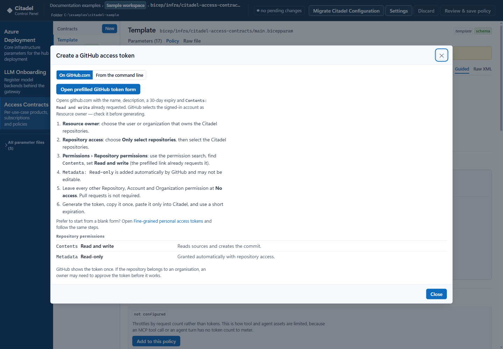
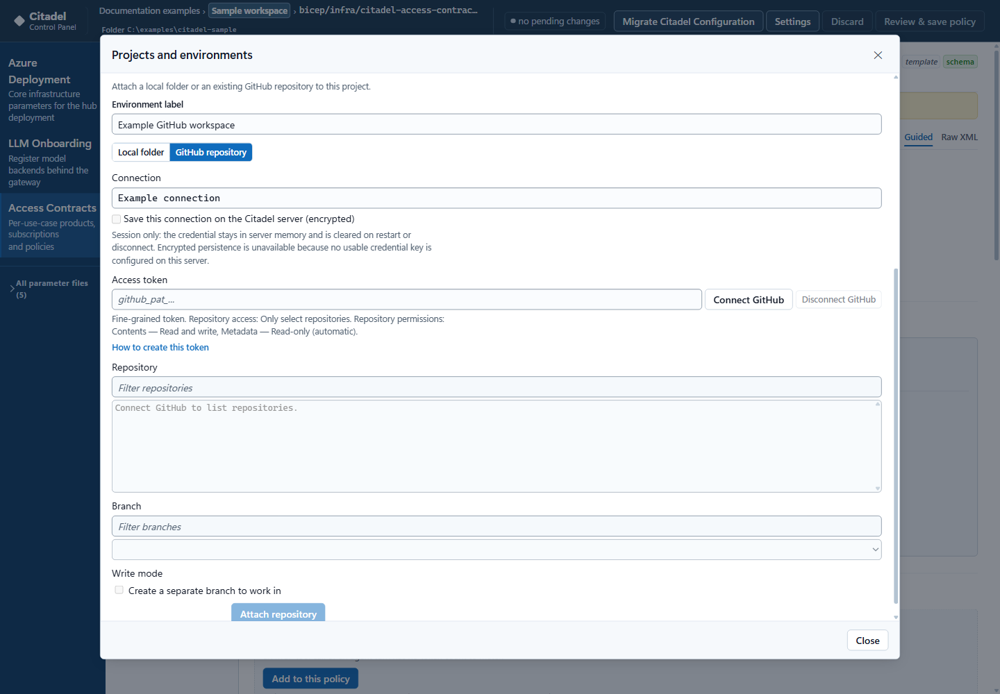
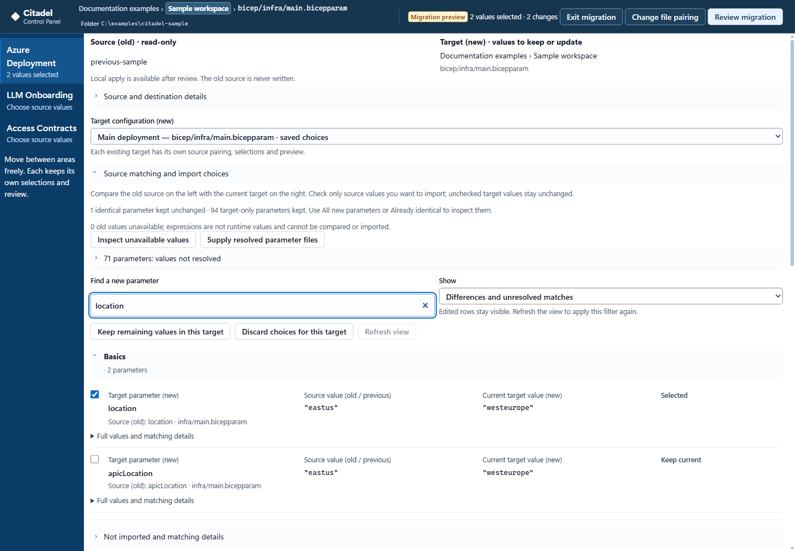
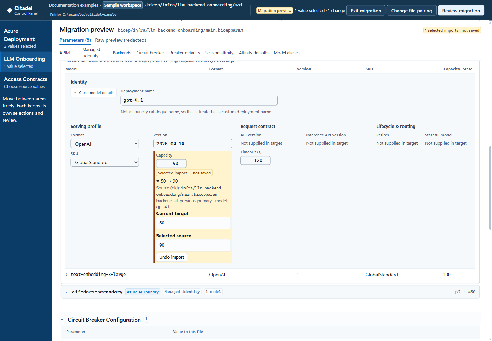
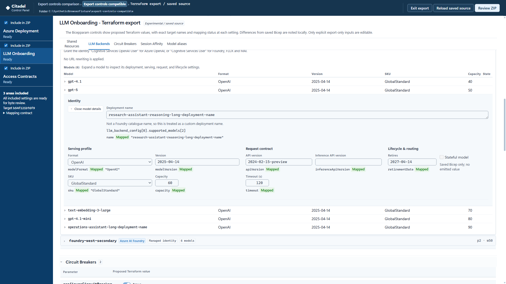

# Using Citadel Control Plane

Citadel Control Plane edits the configuration of a Citadel AI Hub Gateway
repository through independent Bicep/Citadel and native Terraform workspaces.
It reads the banner comments those files already carry and renders
them as guidance, so the explanation beside a field is the repository's own.

Nothing is written until you review and save, and every save is a verified
transaction.

Desktop screenshots use synthetic examples, zero subscription IDs and reserved
`example.invalid` endpoints. They show the actual editor, not deployed services;
placeholder warnings are left visible.

---

## First run

A new container has no owner. The first person to open it creates the account,
and it is the only account that container will ever have.

There is no second user and no password reset. Signing in is what issues the
session token every other request uses, so reaching the URL is not on its own
enough to use the application.

### After a local app update

Save or discard pending work before the container is restarted. After an
[image-only update](./deployment.md#update-an-existing-local-container), refresh
the browser page and sign in with the existing owner. Session-only GitHub
connections need **Reconnect**; encrypted saved connections can be restored
when their credential key remains available.

Keep the same `http://127.0.0.1:4173` origin and browser profile for local folder
access. Completed **Prepared sources** survive in the preserved data directory,
but unsaved editor or migration choices are not a restart/reload recovery
mechanism. New local source imports are memory-only and do not appear in
**Prepared sources**. Keep their dialog open while copying or retrying.
If the app unexpectedly shows the first-owner form, stop and have the
operator check the existing data mount rather than creating a new owner.

---

## Workspaces

A workspace binds one configuration format to a repository source. Choose
**Bicep / Citadel** or **Terraform (native)** independently of **Local Edit** or
**Existing GitHub Repo**. Attached workspaces are listed and open in one click.
Terraform does not require a Bicep workspace or an export first.

Adding one is a guided sequence. Choose **Existing GitHub Repo**, **New GitHub Repo**,
**Create local from Citadel source**, or **Local** to attach an existing folder.
The starter-copy options remain Bicep-only. Existing Bicep repositories are
checked for the required Citadel capabilities. Native Terraform selection
validates just the explicitly chosen supported roots and inputs.

A **local folder** is granted through the browser's folder picker; the handle stays
in the browser profile, because it cannot be moved into a container. **Existing
GitHub Repo** needs a fine-grained token with Contents read and write, limited to
the repositories it should reach. Saves become one commit on a working branch.

Local attachment reports folder checks, configuration reading and metadata
saving, not GitHub branch creation. If the display path is invalid, its error
appears in the attachment dialog. Choose **Back**, correct **Local path**, then
continue and retry **Attach workspace**.

One named GitHub connection can be reused for both formats and different
repositories/branches; selecting Terraform does not require a second token.
A Local attachment has one owner. Another Local workspace needs a distinct
folder, not the same folder or a demonstrably overlapping parent/child.
The typed Local path remains display-only, never filesystem authority.

### Native Terraform workspaces

After choosing the source, add each **native unit** explicitly. A unit is a
native root plus its named value file, not a Bicep-style contract directory.

| Area | Native root | Value file |
| --- | --- | --- |
| Azure Deployment | Repository root | `environments/<name>.tfvars` |
| LLM Onboarding | `llm-backend-onboarding/` | A named `.tfvars` in that root |
| Access Contracts | `citadel-access-contracts/` | A named `.tfvars` in that root |

Select any area independently, or several units in one attachment. Multiple
Access configurations are separate root/file units. Explicit `.tfvars.json`
is additional support, not a replacement for HCL. Files must be direct named
inputs in the listed locations; examples and auto-loaded `.auto.tfvars` are
not live edit targets.

Ignored local `.tfvars` may not exist in GitHub. Choose an existing file or
explicitly allow an empty operator file on first save. Opening a unit never
copies an example, edits a schema default or supplies missing defaults.
The upstream Access example's stray dot is a source syntax error, not something
Citadel repairs silently.

The same fields, switches, object/list controls and backend/model cards are
bound to native names and types. LLM uses `llm_backend_config`,
`backend_id`, `supported_models` and the native model properties. Decimal and
large exact numbers are not forced through Bicep integer rules or JavaScript
rounding. Missing, explicit null and inherited defaults remain distinct.
Unsupported or untyped inputs are identified rather than assigned guessed values.

Only explicitly selected, nonsecret operator files are writable. The bounded
`.tf` schemas/modules and conventional shared policy XML are read-only.
Provider/backend/output configuration, state, plans, credentials, `.terraform`
and unrelated value files are not writable targets. Inventory names do not
grant read access to their contents. The azd subscription bridge is Bicep-only.

Known-sensitive whole files are blocked, even for an unrelated nonsecret edit:
the backup and GitHub commit carry the whole file. Empty/null sensitive slots
may remain; actual credentials must stay outside this workflow. Detection is
conservative, not proof that arbitrary files are secret-free. Citadel does not
silently strip secrets or offer encrypted sensitive-file authoring. The exact
public PII placeholder in the pinned schema is recognized as a schema default
only, never as an exception for a supplied operator secret value.

Access policy edits use the owning service's literal `policy_xml`. The editor
encodes Terraform literal template escapes while preserving unrelated source.
In the pinned Access root, an empty string chooses the conventional default;
the `.tf` configuration determines that behavior. Inspect the shared policy
source through its read-only disclosure. It may affect other units, so it is
not presented as an exclusively owned editable file. `file()` is not valid in
`.tfvars`; the default's `file()` belongs to `.tf` configuration. XML receives a
tag-balance check, not APIM/runtime validation.

These are selected source inputs, not effective runtime state. The pinned
gateway has declared-but-unconsumed parameters and module/model/circuit-breaker
wiring limitations. A referenced variable does not prove every nested setting
affects deployed resources. Terraform export's missing-equivalence rules are
separate and do not block an otherwise valid native edit. No provider, script,
state, cloud ID, Terraform or APIM expression is evaluated here.

#### Switching and reconnecting

Switch through **Settings** or the catalog without reloading the whole page.
Each workspace/unit retains its own parameter draft, in-app nonsecret policy
buffers, selection and editor state. Nonsecret parameter drafts also retain
source hashes and native profile/unit/parser identity in browser storage.
Do not depend on page-close recovery for unsaved external XML policy buffers.
Known-secret buffers are not persisted.

Changed source or schema identity preserves/quarantines the old draft with an
explanation; it is not silently applied to another file. Native binding changes
(format, root, input file, repository or branch) require a new workspace identity.
Older Bicep workspaces without descriptors keep their existing IDs and history.
Unknown future descriptor versions are refused.

A native Local workspace reconnects only its original retained handle. If the
browser profile lost that handle, attach a new workspace rather than move old
drafts/history onto an unproven folder. GitHub credentials can be shared, but
overlapping native writable files on the same repository/working branch cannot
have multiple owners. Different credentials or project labels do not make the
destination different.

Disjoint GitHub units still share their branch head. A save in one invalidates
other old approvals while preserving their drafts for a fresh review. Commits
are exact-head and non-forced. A refused save creates no rescue branch unless
the user explicitly names one; creating that branch does not retarget the
native workspace.

#### Local creation and parser boundaries

Keep the folder untouched by other applications while creating a new input.
The confirmation explains that simultaneous same-path creation cannot always
be distinguished. Absence/content/mtime/dependency checks and supported
exclusive writable streams are not OS-level exclusion or atomic create-if-absent.
Detected collisions stop; an unexpected file at a create target is not offered
the existing-file overwrite workflow.

Successful creation has a scoped **History > Undo creation** action while its
bytes still match. A failed/ambiguous creation is not adopted or deleted from
matching bytes alone. Keep or move an unattributable file yourself; recovery
can close that creation attempt once the selected target is absent. Existing
file recovery likewise refuses foreign bytes or changed dependencies.

The offline parser supports literal HCL/JSON with source spans, comments,
quoted labels, exact numbers, Unicode, CRLF/LF and supported heredocs. Duplicate,
malformed and ambiguous inputs are refused. Functions/traversals/calculations
are not evaluated as value-file literals. A valid HCL `2e30` is currently
unsupported by the selected grammar; the entire document is kept read-only
and byte-identical, not normalized to another spelling. Decimal-mantissa
exponents work, and explicit JSON supports integer-mantissa exponents.
Leading-zero numeric spellings remain an explicit read-only editor limitation.

Bounds are 512 KiB per source, 64 literal nesting levels, 32 schema type levels,
100,000 CST nodes, a 300 ms parse deadline, 1,000 operations and 1,024 characters
per exact number. Dependencies are bounded to 150 files / 4 MiB. Simple literal
`contains` validations are checked; other validations say they are unevaluated.
This is not a substitute for validation in your own Terraform workflow.
The [parser packaging notes](../CitadelUI/README.md#offline-native-parser)
record the pinned licenses, offline rebuild and minimal CSP allowance.

### Create a local project from Citadel source

Choose **Settings > New project > Create local from Citadel source**, or the
same option in **Add workspace** / **Add your first workspace**. To use files
already on disk instead, choose **Attach existing local folder** in Settings
or **Local** in the catalog. Neither local path requires a GitHub token.

1. Review **GitHub source URL**. The default is
   `mohamedsaif/ai-hub-gateway-solution-accelerator` at **`citadel-v1`**, not
   `main`. **Prepare source and continue** resolves the revision once to a
   commit, validates the complete tree, and transfers every file to this browser.
   A public repository root, `/tree/ref`, or the published `/blob/ref/` root
   link can override the default. A slash in a ref is not guessed to be a subfolder.
2. Enter the project and workspace labels, the display-only parent **Local path**,
   and **New project folder name**. The suggested folder name can be edited.
   Choose an **empty parent folder** through the browser picker. Hidden files
   and `.git` also make it nonempty. Names must be single Windows-safe names;
   the workspace registry permits at most 160 characters and reserves
   `.azure`/`.env` names. Invalid names are rejected, never silently truncated,
   sanitized or suffixed. The complete display path must fit within 1024 characters.
3. Review the source, revision, full resolved commit, selected parent, and exact
   new child destination. Confirm the checkbox and select **Import and open
   workspace**. Keep the destination untouched until the operation finishes.
   Citadel creates that named child, copies and verifies every byte, checks
   Citadel compatibility, and only then registers and opens it. The child is
   the workspace root, not the selected parent.

This is a complete source snapshot, including ordinary licenses, dotfiles,
scripts, and binary assets. It is **not a Git clone**: there is no `.git` history,
remote, executable-mode restoration, script execution, deployment, or old-value
migration. Existing local projects and GitHub repositories are not modified.
Public reads are anonymous; existing editable GitHub credentials are not borrowed.
Preparation is bounded to 64 MiB total, 8 MiB per file, 10,000 files, 20,000 tree
entries, and 2,000 directories. Symlinks, submodules, Git LFS pointers, unsafe or
case/Unicode-colliding paths, incomplete trees, and incompatible layouts stop it.

**Pause** stops at a safe checkpoint. A source failure or rate limit is explicit;
retry keeps the same resolved commit, and a rate-limit message gives the retry
time. Source preparations expire after 30 minutes or a server restart. Once
transferred, the verified browser bytes support local retries without reading
GitHub again. Changing the source explicitly starts a new preparation.

The browser rechecks folder permission, entry identity, and content around each
write, but cannot exclude another program's writes or promise atomic directory
creation. An existing child, even an empty one, is rejected when detected.
Detected conflicts stop without overwriting the conflicting data. Write,
permission, or registration failures retain the partial folder and show recovery
actions; no automatic cleanup deletes files. **Retry verified import** resumes
only attributable, unchanged entries. **Choose another destination** retains the
old folder. **Keep folder and close**, a reload, or closing the tab loses the
in-memory retry record, so a later import must use a fresh empty destination.
A completed but unregistered folder can instead use ordinary existing-folder
attachment after any reported registry recovery is resolved.

### Add a GitHub token

Choose **Add workspace** (or **Add your first workspace**), then **Existing
GitHub Repo**. If connections already exist, choose **Add a new connection**.
Enter a **New connection name** first to enable the **GitHub token** field, paste
your fine-grained personal access token, and select **Continue**. Choose a
repository and explicitly select its branch, such as `main`.

**Token help** beside the token label expands inline creation steps and a link
to GitHub, without clearing your entries. It is available before you name the
connection and when replacing a token through **Reconnect**.

In **Settings > GitHub repository**, **How to create this token** opens help over
the unfinished Settings form. **Close** or **Escape** returns to that form and
the help opener, keeping the chosen source, environment label and connection
name. Opening help does not submit a connection or enable credential storage.

After returning, the unfinished GitHub form is still in place:

Create the token in GitHub's **Settings > Developer settings > Personal access
tokens > Fine-grained tokens**. Select the intended resource owner and
**Only select repositories**, with **Contents: Read and write**.
**Metadata: Read-only** is included automatically. Classic tokens and the OAuth
token returned by `gh auth token` are not accepted.

Leave other permissions unset: Pull requests, Actions, Workflows and
administration permissions are not needed. Contents read-only cannot create
branches or save edits; Citadel does not offer a read-only workspace mode.
If the organization requires approval, a pending token can only read public
resources until an organization owner approves it.

Enter the token only in the UI, not in `container.env`, a Compose file, or an Azure
parameter file. Local-folder workspaces do not need a GitHub token.

**Save this connection on the Citadel server (encrypted)** is optional and
unchecked for a new connection. Left unchecked, the credential stays in server
memory and is cleared on restart or disconnect. When checked and a usable
credential key is configured, it is saved encrypted on that server and can be
restored after restart; this is not storage in the browser or on the operator's
device.

The default local deployment has no credential key mounted, so encrypted saving
is disabled with an explanation. Token entry and session-only GitHub access
still work. After a container restart, use **Reconnect** and supply a token for
the same account. Settings describes the selected connection's actual storage
mode; a failure to load storage availability is reported rather than assumed
to mean a key is missing.

These permissions apply to editable workspaces. Reading an older GitHub source
for migration needs only Contents read access, as described below.

---

## Migrate Citadel Configuration

Open the **current destination workspace**, then choose **Migrate Citadel
Configuration (Experimental)** in its command bar. The older repository is a read-only source:
it does not need to pass current workspace compatibility checks and is not
attached as another editable workspace. The destination's current parameter
names and templates remain authoritative.

### Source

Choose **Local folder**, **Parameter files**, or **GitHub repository**.

| Source | Access |
| --- | --- |
| Local folder | Read-only browser permission for the currently checked-out files |
| Parameter files | Explicit `.bicepparam` files or strict ARM deployment-parameters JSON; selected `.bicep` files can provide source schema metadata |
| Public GitHub | **GitHub access > Public repository (anonymous)**; no PAT |
| Private GitHub | **GitHub access > Personal access token** or **Saved GitHub connection** |

For a source PAT, select only the repository to read and grant **Contents:
Read-only**; **Metadata: Read-only** is automatic. Write, Administration, Actions,
and all-repository access are not required. **Token help** links to GitHub's token
creation page. A pasted source token is session-only and is cleared from the
form on submission. Reusing a saved connection creates a separate source session
without replacing or signing out the destination connection.

Select **Connect source** for a PAT, or **Use source connection** for a saved
connection. Enter the repository root URL and use **Find repository** to load its
actual branches into **Source branch**. Select one explicitly, then use
**Prepare source and continue** beside the revision controls to capture the
offline copy. Finding a repository only loads its branches; it does not capture
the source or change the target. **Refresh branches** / **Retry branches** handles a changed list
or failed lookup; the 500-branch listing limit is reported when reached. Tag names
and full commit SHAs remain manually enterable in their respective ref modes.
A `/tree/main` URL must be entered as the repository root plus a separate `main`
selection. The default branch is metadata, not an automatic selection. Changing
repository, source access, or ref type clears the previous selection.
Local folder selection reads files already on disk; it does not check out a branch.

Automatic repository discovery distinguishes ordinary JSON (such as
abbreviations, OpenAPI, package, and workflow data) from ARM parameter envelopes.
Ordinary JSON is not imported and does not block valid configuration discovery.
Invalid parameter candidates and unreadable files remain explicit errors; an
explicitly selected JSON file must still pass the strict ARM parameter format.

### Files and mapping

Source preparation copies supported configuration and referenced templates once
into private application storage. A complete copy survives restart and loss of
the original source. Reuse it from **Prepared sources**; only **Refresh old source**
downloads/reads again. Failed refresh retains the old copy and all target drafts.
Copies contain sensitive configuration and are retained until owner deletion,
within 8 copies / 256 MiB total and 64 MiB / 256 files per copy.

The familiar **Azure Deployment**, **LLM Onboarding**, and **Access Contracts**
rail now navigates independent drafts without a switch popup. Select source configuration and one
existing current destination. Filenames are secondary identity, never automatic
pairing evidence. Loose parameter files with no recognizable layout/signature
require an explicit area choice.
Every target, including multiple Access instances, retains its own choices and
preview. Ordinary navigation does not discard them. Replacing a named target's
file pairing is explicit and can be cancelled without losing its saved choices.
For unfamiliar old layouts, choose a new destination and use **Other old parameter
files** to select a parsed old file by matching new-file names.

Access Contracts lists actual instances, not root/base templates. Upgrade,
publish-contract, module, policy, and validation/sample files are outside this
migration. Missing areas and unreadable or unsupported input are reported rather
than replaced with hypothetical items.

Choose **Inspect mapping**. Names match using Bicep's case-insensitive identifier
rules, preserving the destination's casing. Only assignments already present in
the new file can receive values; old-only and schema-only parameters are never
introduced. Each source/current file pair reports
its old-only names, or **None** when there are none, without exposing unused values.
Duplicate candidates remain separate for review rather than being resolved by
file order.

**Migration preview (Experimental)** is the main-page typed target form, with the existing
sections, object tables, feature toggles and backend/model layout. Choose **Use
source value**, or open **Match source values** to resolve competing candidates
and model pairings. Only changed selected fields show **Selected import - not
saved**, with current/source values, exact provenance and **Undo import**.
Equal and unselected fields have no import highlight. The form never calls normal
editor save actions or the subscription/environment bridge.
**Show imported** narrows the preview without changing your selections; **Show
all** restores the complete target form.

Matching starts with **Differences and unresolved matches** rather than all new
parameters. **Find a new parameter** filters names as you type, keeping keyboard
focus and the text selection. **Show** offers other worklists. Returning through
**Match source values**, including from Review, keeps your search and chosen
worklist; a field-specific matching action can reveal its relevant row.

Resolve competing old sources explicitly. Full values, current
constraints and provenance are available on demand. Unchecking a prior import
or choosing **Discard choices for this target** removes only that target's decisions.
Edited rows stay visible until you type a new search, change **Show**, or choose
**Refresh view**. Changing selections returns to editing and requires a fresh
**Review migration** before applying.
Expressions, references, sensitive values, unsupported
schemas, and incompatible types remain unresolved rather than being evaluated or
coerced. Matching names do not prove that feature behavior or meaning is unchanged.
An expression is not a saved environment value: migration does not evaluate
functions, variables, or environment inputs. Supply resolved source values to
import those settings; unselected target expressions remain unchanged.

### Review and apply

For LLM configuration, confirm each new-to-old backend pairing before comparing
models within it. Select model fields explicitly; the new backend identity,
endpoint/auth/routing and all unselected models/fields stay unchanged. Unknown,
duplicate or incompatible identities are not guessed, and the old backend array
cannot be imported wholesale.

The example below changes only the selected model's capacity from `50` to `90`.
Its old backend is explicitly paired; the other model and backend stay unchanged.

Choose **Review migration** to review selected values and intentionally keep the
rest. No-op previews say **Nothing will change**; remote destinations say
**Preview/export only**. **Download report**
and **Download sanitized draft** do not write either repository. The draft omits
sensitive and unresolved expression values; it is a manual handoff, not a
deployment-ready replacement file.

For a local destination, **Apply selected values** asks for explicit confirmation
and uses the normal backup, verification, and rollback transaction. Pending editor
work, changed target files/templates or a switched workspace prevent overwriting
newer work. Original-source changes do not invalidate a complete offline copy.
Target failures retain source and other drafts. Unrelated retained expressions
are unverified deployment findings; invalid selected changes and their required
dependencies still block apply. Source repositories are
never written. GitHub destinations remain **preview/local-export-only**, even
when the ordinary workspace connection has write permission.

Use **Review another file** for another area or file pair. Separate name reports
remain available in the wizard, including after an apply; **Download all per-file
name reports** saves that history before closing. Changing or leaving an
authenticated source erases its source session. If erasure cannot be confirmed,
retry the reported cleanup instead of assuming the token has been removed.

Migration does not run deployment or upgrade scripts, clone Access Contract
policies, or translate resource outputs between upgrade files. For exact target
paths, supported formats, limits, and the pinned older `main` sample, see the
[migration reference](../CitadelUI/README.md#migrate-citadel-configuration).

---

## Export to Terraform

**Export to Terraform (Experimental)** generates fresh Terraform variable files
from the saved Bicep configuration. It is a desktop experiment, not a Terraform
editor, deployment, or state migration. The current Bicep/XML editor and its normal
save actions remain the source of truth.

1. Save or deliberately discard ordinary parameter/policy drafts, then choose
   **Export to Terraform (Experimental)**. An attempted entry with drafts keeps
   them and explains why export cannot start.
2. Use **Include in ZIP** on the area rail and choose one **Saved source** per
   included root. Select one Access contract explicitly when several are available.
   A contract may contain multiple services, but separate contracts are never
   merged or assigned invented filenames. Only saved `.bicepparam` inputs appear;
   XML policies and `.bicep` templates are not configuration choices. No saved
   configuration and several available choices have distinct messages. Reopen
   export after creating a new saved configuration.
3. Review proposed Terraform values in the same Bicepparam switches, selects,
   number/text fields and grouped records used by the ordinary editor. The
   corresponding Terraform name and status appear locally; changed saved values
   are noted separately. One-to-many mappings show each target value, not a
   duplicated whole-object report. Enter explicit export-only values such as
   `subscription_id` and `managed_identity_client_id`, and inspect the service's
   displayed defaults before accepting them.
4. Resolve every blocker in each included configuration. **Review ZIP** shows
   the exact variable files and hashes. **Back to mapping** permits revision;
   area navigation retains separate inputs and selections.
5. Choose **Approve & export ZIP**. Changed source, template, policy or workspace
   invalidates approval. Use **Reload saved source**, inspect the revised values
   and review again. Cancel in the exit confirmation keeps export open; **Exit export**
   clears only its in-memory choices and restores the ordinary editor.

| State | Meaning |
| --- | --- |
| Mapped | A consumed target input preserves the setting. |
| Transformed | Explicit property conversion, equivalent fixed behavior, or a proven inactive setting is explained. |
| Needs input | A nonsecret literal or deliberate target-only choice is missing or invalid. No environment fallback is guessed. |
| Requires Terraform change | Active source behavior has no faithful mapping to the pinned target wiring. |

Custom unwired names, rich logging differences, Redis HA wiring, Foundry
injection/model losses, active session-aware routing and extended Access
gateway/rotation capabilities can block export. These are target wiring
limitations, not claims that Azure lacks the capability. Excluding a whole area
is a deliberate scope choice; it cannot waive a blocked setting in an included
area. Empty generated-name overrides require an explicit naming decision and
do not imply that Terraform will address the existing Bicep-created resources.

LLM runtime metadata follows the first exact-case model occurrence in Bicep.
The pinned Terraform root looks only in backend zero, then falls back to
`apiVersion = "2024-02-15-preview"`, `timeout = 120` and an empty
`inferenceApiVersion`. A model first present in a later backend is blocked when
those effective values differ; absent/default-equivalent metadata still exports.
Later duplicate occurrences cannot override the first occurrence's metadata.
Blocked backends and models carry an indication even while collapsed. Expand a
model to **Inspect model details** in the usual Identity, Serving profile,
Request contract and Lifecycle & routing groups. Field-level reasons remain
visible, and full indexed paths are secondary mapping details. Inspection and
help do not grant permission to edit the saved source.

Access uses the same use-case fields and service records. A service's **More**
control opens the shared XML view for its exact proposed policy; no policy or
model array is duplicated as a flattened output dump.

The ZIP has no wrapper and contains only the selected files:
`environments/<environmentName>.tfvars`,
`llm-backend-onboarding/terraform.tfvars`, and
`citadel-access-contracts/terraform.tfvars`. The environment identity must be
3-24 lowercase letters, numbers or hyphens, with no reserved
device name; invalid identities are rejected, not renamed.
Source XML is embedded literally as `policy_xml`, preserving APIM expressions
and named-value references while escaping Terraform template markers. There are
no XML extras, reports, modules, providers, credentials or state in the archive.

**Mapping contract** in the rail identifies version `citadel-terraform-export-v1`
and target commit `b54f121b7df912da61cb0302a63b9f870841ac2c` of
`Azure/terraform-ai-gateway-landing-zone`. The experiment checks known shapes,
literal types and locally available policy dependencies, not cloud permissions,
external runtime dependencies or deployment parity. Keep source files stable
while approving; the browser cannot lock an entire repository. Limits are three
files, 8 MiB per file, 24 MiB total, and 64 source dependencies. Export inputs
remain in memory and are never written back to Bicep or the workspace registry.

---

## Create a new private GitHub repository

**New GitHub Repo** creates a repository in the connected token's personal account.
It is always **private**; there is no public option or organization-owner selector.
An existing repository with the requested name is never overwritten.

1. Connect the account with a temporary creation token. **Token help** in this
   mode explains the additional permissions below. Use **Update token for
   repository creation** if a saved connection only covers existing repositories.
2. Enter the new repository name. **Source repository URL** starts at
   `https://github.com/mohamedsaif/ai-hub-gateway-solution-accelerator/blob/citadel-v1/`.
   You can replace it with another GitHub repository or branch URL. The explicit
   `citadel-v1` ref is used, not the upstream repository's default `main`.
   Use an unencoded `https://github.com/owner/repository` or `/tree/ref` URL.
   File/subdirectory URLs, credentials, query strings, fragments and other hosts
   are not accepted.
3. Choose **Check source**. Citadel pins a commit, checks compatibility and the
   complete file snapshot, and shows its file count and size. This creates
   nothing on GitHub. Review it, then choose **Create private repository**.
4. After the full snapshot is verified, **Continue to repository** returns to the
   normal repository, branch, details and attachment review steps. Branch choice
   and later editing behave exactly as for Existing GitHub Repo.

Creation needs **All repositories** access under the connected personal account:
the new repository cannot be selected before it exists. Grant **Administration:
Read and write** to create it and **Contents: Read and write** to populate it.
**Metadata: Read-only** is automatic. This is broader than the normal editor
token; afterward narrow it to the new repository and remove Administration, or
reconnect with a regular Contents-only token.

Only if the source preview reports `.github/workflows` files, also grant
**Workflows: Read and write**. Citadel disables Actions on that new repository
before copying those files and leaves Actions disabled for your review.
No Actions, Pull requests or organization permission is required.

The result is a fresh snapshot on `main`, not a fork or a copy of upstream commit
history. All checked-in files, including binary assets, dotfiles and license
notices, are part of the copy; the editor's normal Bicep/XML filter is not used.
Unsupported files, unsafe URLs, oversized snapshots and incomplete trees are
reported rather than silently omitted.

GitHub initially creates a small bootstrap commit. If the account's default
branch is not `main`, Citadel publishes the verified snapshot on that known
branch and then renames it to `main`. It does not delete a bootstrap ref or force
a branch update. A concurrent branch or default-branch change pauses setup
instead of being overwritten.

Supported source files are regular Git files (`100644`) and executable files
(`100755`); bytes and modes are preserved. Symlinks, submodules and Git LFS
pointers are rejected before repository creation.

| Source limit | Maximum |
| --- | --- |
| Total checked-in file bytes | 64 MiB |
| Individual file | 8 MiB |
| Files | 10,000 |
| Directories | 2,000 |
| Git manifest entries | 20,000 |
| Manifest response | 8 MiB |
| One directory's encoded tree request | 16 MiB |

The tree-request limit includes JSON escaping, so a source below the total-byte
limit can still exceed a per-directory limit. These limits are enforced during
preflight, not by dropping files. Import writes are paced and pause at the
importer's rolling 60-per-minute or 450-per-hour budget, or when GitHub reports
a rate limit.

**Pause setup** preserves progress. If a repository has already been created,
it remains private and is never automatically deleted. Return through **New
GitHub Repo**, open **Previous setup attempts**, and resume the same attempt instead
of creating another. After a container restart or token expiry, reconnect the
same account first. Permission and rate-limit failures are shown with the
retained repository; a successful import is not reported until the complete
snapshot is verified.

If recovery state cannot be written, the importer stops further GitHub requests.
Restore access to the persistent data directory, then resume the retained
attempt. Confirmed publication is never replayed over a later external reset.

---

## The three areas

The following area walkthroughs describe the existing Bicep controls. Native
Terraform uses the selected native schemas and semantics described above.
The Bicep gateway configuration falls into three areas, shown down the
left. Every other parameter file in the repository stays reachable under **All
parameter files**.

| Area | Edits | Answers |
| --- | --- | --- |
| Azure Deployment | `bicep/infra/main.bicepparam` | How the hub itself is built |
| LLM Onboarding | `llm-backend-onboarding/main.bicepparam` | Which models sit behind the gateway |
| Access Contracts | One folder per contract | Who may use them, and under what limits |

---

## Azure Deployment

The hub's own parameters, grouped into the sections the file already declares:
Basics, Features, Resources, Networking, Inference logs, Compute and Accelerator.

### Feature flags turn capabilities on and off

Each flag decides whether a capability is deployed at all. Turning one off does not
merely hide it — the resources behind it are not created, and the parameters that
belong only to it stop being asked for.

The flags are grouped by what they affect: gateway APIs such as model inference,
document intelligence and realtime; data, safety and governance such as AI Search,
managed Redis, PII redaction and API Center; identity and observability such as
Entra authentication and Application Insights dashboards; and network topology.

A disabled capability hides only the inputs proven exclusive to it by the Bicep
module graph. Shared settings, and any unsaved edits that depend on them, stay
visible rather than vanishing with unsaved work inside them.

### Networking understands the address plan

Address fields are checked when you leave the control, against Azure's own rules
rather than a regular expression.

Each prefix reports what it actually buys — `64 total addresses · 59 usable after
Azure reserves the first four and last address` — so an undersized subnet is
visible before deployment rather than after it.

Subnets are checked against one another. An overlap is named precisely, on both
fields involved, and blocks the save:

The header keeps a running count of blocking errors, and **Review & save** stays
disabled while any remain. The same checks cover malformed and non-canonical
CIDRs, ranges Azure prohibits, subnets that fall outside the VNet, unsupported
prefix sizes, and insufficient capacity for the services and private endpoints
that must fit inside them.

---

## LLM Onboarding

Everything about the models behind the gateway: the API Management instance they
are registered on, the managed identity used to reach them, the backends
themselves, circuit breaking, session affinity and model aliases.

`llmBackendConfig` is an untyped array in Bicep, which means the compiler cannot
help you and neither can a generic form. It gets a purpose-built editor instead.

Each backend names its provider, endpoint and authentication mode. The editor
knows the default authentication mode for each provider type, shows the derived
default, lets you override it, and asks for a named value or Key Vault URI only
when the chosen mode actually needs one. Plain-text secrets are flagged.

Priority and weight control routing between backends. Adding a model offers the
models known to work with that provider, rather than requiring the exact string
from memory.

---

## Access Contracts

One contract is one use case: a product, its subscriptions, and the API Management
policy that constrains it. Each has a parameter file and may reference its own
policy document. A contract without its own policy uses the module default;
the catalog distinguishes **own policy** from **default**.

Opening one gives its parameters, its policy or default-policy status, and the raw
file.

### Editing the policy

The policy is API Management XML. The editor presents it as the blocks it is
actually made of, each of which can be switched on or off, with the raw XML always
one click away.

This example edits the **Template** policy document. A contract marked **Policy
(default)** reports its fallback rather than presenting a separate policy to edit.

Scope, allowed models, token limits, request rate limits, quotas, content safety,
semantic caching, authentication, PII handling, alerting, response headers and
policy fragments each appear as a block. The header shows how many are active.

The editor checks the policy against the rest of the repository, not just against
itself. A model allowed here that has not been onboarded in LLM Onboarding is
flagged by name — a mistake that would otherwise surface as a runtime rejection
long after the deployment succeeded.

---

## Reviewing and saving

Edits accumulate as pending changes. The header shows how many there are and
whether anything blocks the save.

**Review & save** shows what will be written before it is written. On confirmation
the browser backs up every target, writes, verifies the resulting hashes, and
records the receipt. Safe rollback restores verified backup bytes; uncertain
receipts or foreign changes retain an explicit recovery record instead of
overwriting an unrecognized file. If a receipt response is lost after a confirmed
commit, the saved journal is used rather than blindly undoing that save.

For a GitHub workspace, a save becomes one commit on a working branch you choose.
For a local folder it is written through the same verified transaction directly to
disk.

For an already-open **existing Local file**, Review/Save compares the loaded
version with the current disk bytes. If it changed externally, choose **Cancel**
to keep the draft, or **Back up and overwrite** to replace the external version
with the reviewed proposed contents. The backup includes the external edits:
it is the current disk file, not merely the stale version originally opened.
A failed backup writes nothing. Another change after confirmation stops for
fresh confirmation; there is no force flag bypassing hashes, schema, permission,
secret-file or workspace guards.

This is an explicit overwrite, not an automatic merge or rebase. Detection
occurs at the existing review/save checkpoints, not through an OS watcher or
periodic auto-reload. Normal explicit reopen/reload remains available. The
confirmation does not apply to a newly created file or weaken GitHub's exact-head
atomic commit rules.

**Discard** abandons every pending change without touching the repository.

Each save appends a redacted, hash-chained entry to the activity log, reachable
from the landing page.
