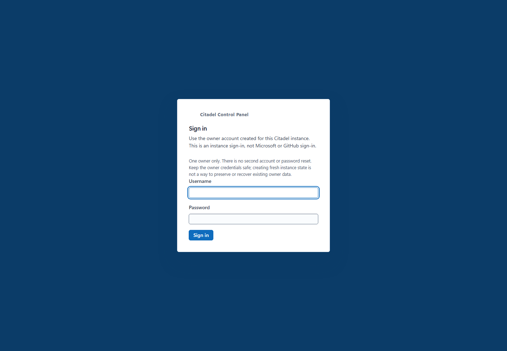
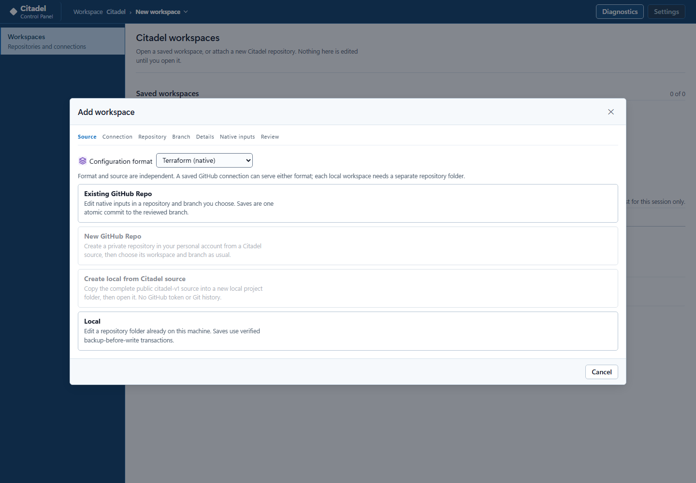
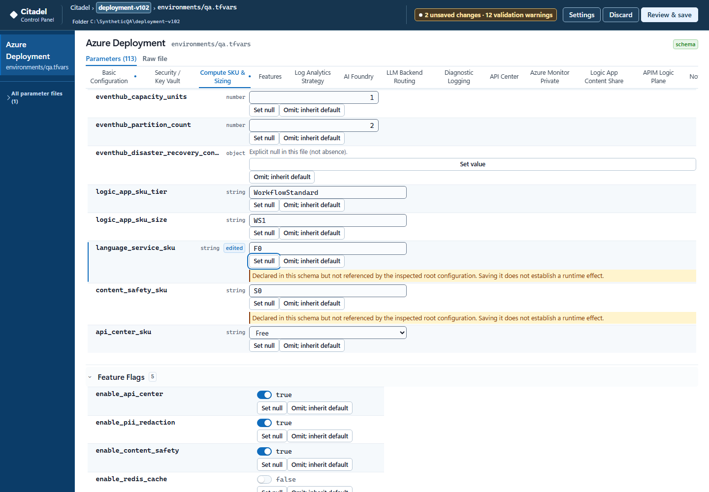
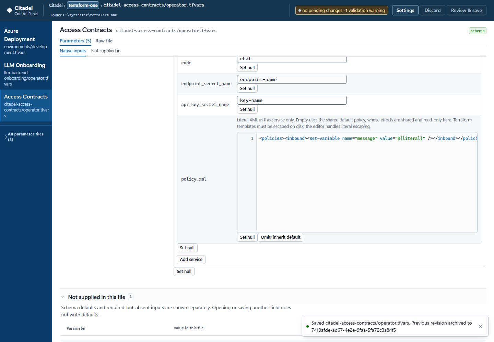
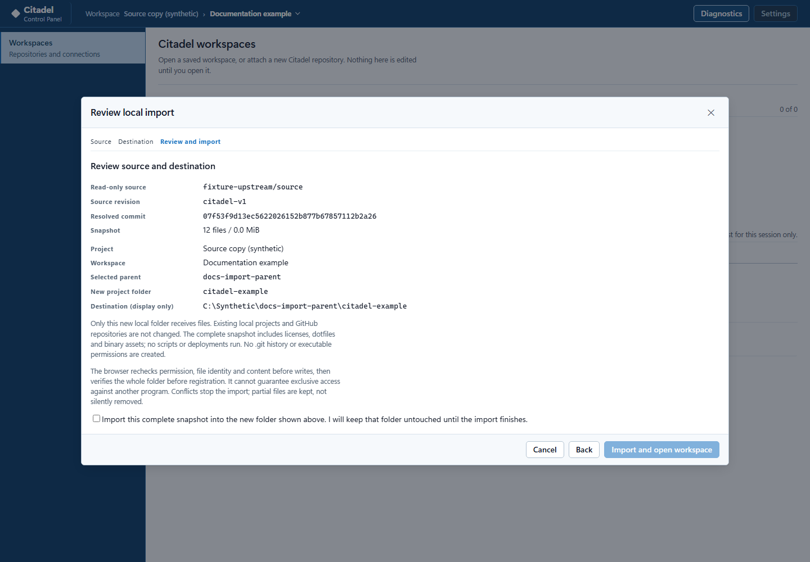
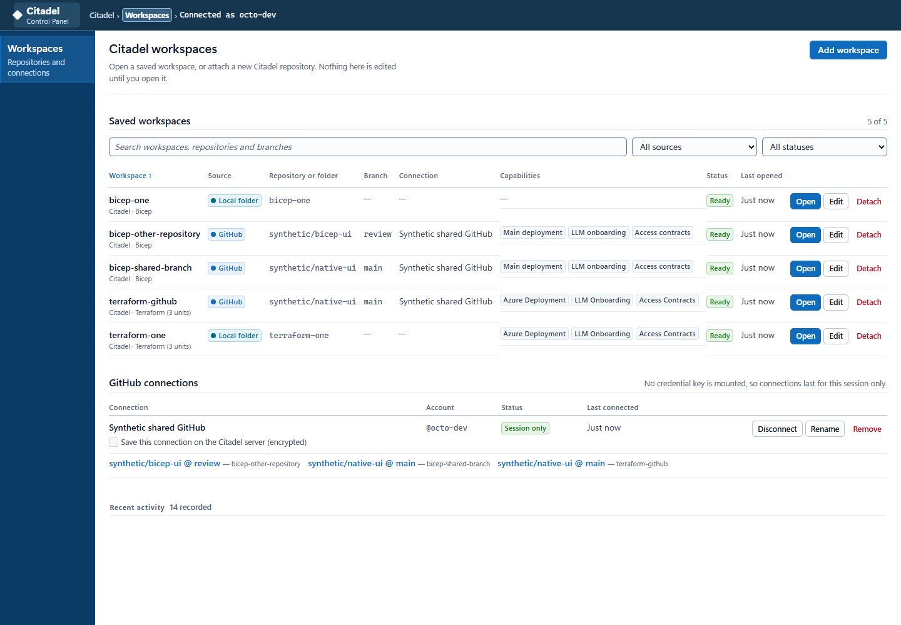
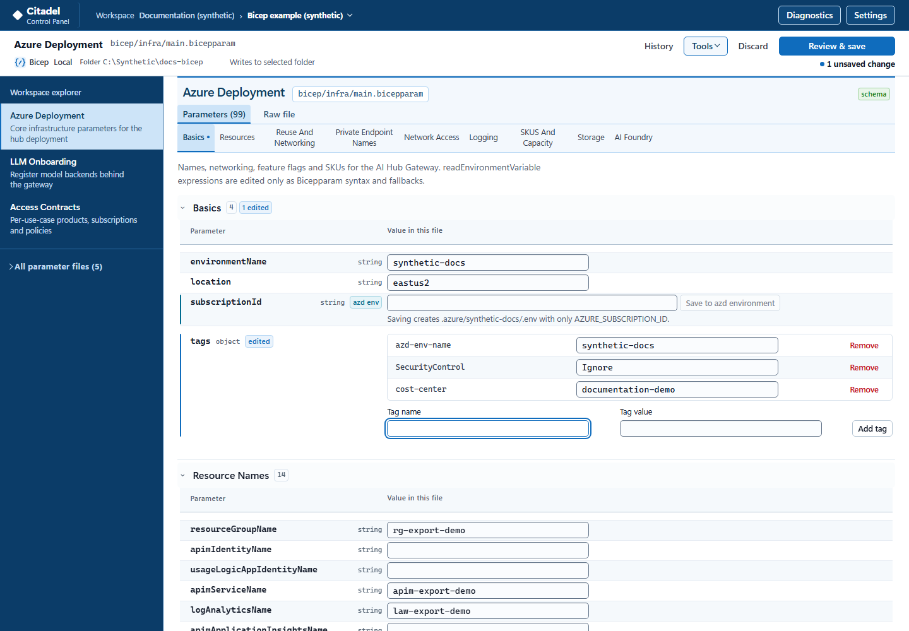
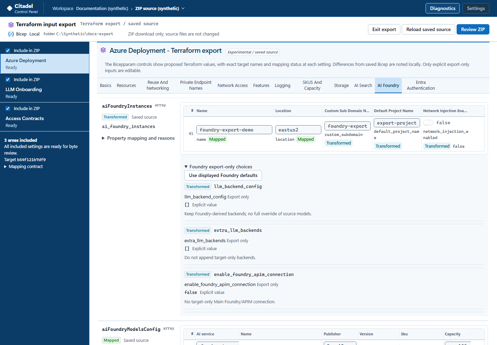
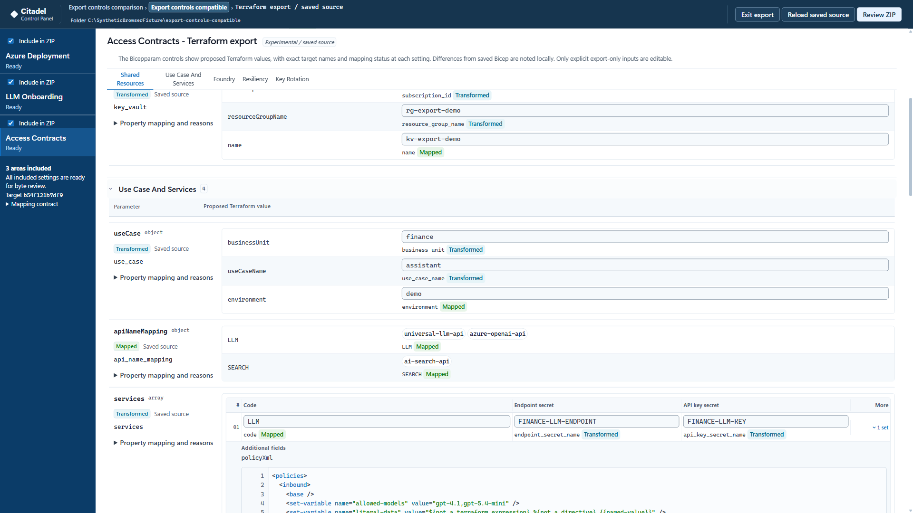
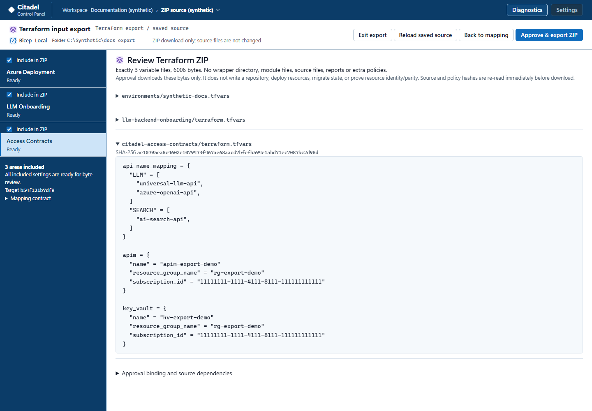

# Using Citadel Control Plane

Citadel edits Bicep/Citadel configuration and native Terraform inputs in
independent workspaces. Changes remain drafts until you review and save.
It does not run Terraform, deploy resources or manage state.

This guide describes the current UI included in desktop release
`citadel-ui-desktop-v1.1.7`, with application baseline
`772b49ff0a09a937a267c08c21f80c3247d6c1e6`.
Use the [pinned release checkout](../README.md#start-with-a-clone) or an
operator-supplied image built from reviewed source, not an older `main` checkout.
Documentation or source publication does not update an existing installation.
Screenshots use synthetic files, labels and endpoints, not deployed services.

| Start here | Task |
| --- | --- |
| [First run](#first-run) | Claim a new instance or sign in |
| [Workspaces](#workspaces) | Choose format and Local/GitHub source |
| [Native Terraform](#native-terraform-workspaces) | Select roots and operator value files |
| [Open a saved workspace](#open-a-saved-workspace) | Resume an existing editing profile |
| [The three areas](#the-three-areas) | Work with Bicep configuration and policy |
| [Resource tags](#resource-tags) | Stage source-defined literal Bicep tag additions, edits and removals |
| [Reviewing and saving](#reviewing-and-saving) | Confirm the destination and handle conflicts |
| [Migration](#migrate-citadel-configuration) | Bring older values into current Bicep templates |
| [Terraform export](#export-to-terraform) | Download Terraform inputs from saved Bicep values |
| [Timed diagnostics](#troubleshooting-with-debug) | Capture a bounded support report |

## First run

Use the **Electron desktop application**, or desktop **Microsoft Edge or Google
Chrome** for container/hosted instances. Local folder access requires
the File System Access API and a secure browser context: HTTPS when hosted,
or the supported container origin <http://127.0.0.1:4173>. Electron uses
<http://127.0.0.1:4174>. Keep the same origin and browser/Electron profile to
retain folder permissions.

1. Open the instance supplied by your operator.
2. On a new instance, enter a username and password and choose **Create owner
   and continue**. The first person to claim it becomes its only owner.
3. On an existing instance, choose **Sign in** with that owner's credentials.

There is no second account or password reset. Store the password safely.
If an established instance unexpectedly asks you to create an owner, stop and
have the operator check the original data mount. Do not create a replacement
identity or delete state to repair sign-in.

### After a local app update

Save or deliberately discard pending work before a planned restart. After an
[image-only update](./deployment.md#update-an-existing-local-container), refresh
the page to load the new browser code and sign in with the existing owner.
Session-only GitHub connections need **Reconnect**. Encrypted saved connections
can be restored when their original credential key is available.

Keep the original browser origin, profile and local folders. Completed migration
**Prepared sources** survive in preserved application data. Unsaved editor,
policy, migration and export choices are not a general restart/reload recovery
mechanism. A local source import's retry record is memory-only: keep its dialog
open while copying or retrying.

## Workspaces

A **project** groups named editing profiles. A **workspace** binds a configuration
format to a source and its editing state; some Settings and storage fields call
it an **environment**. These names do not create a deployed environment or a
Terraform CLI/state workspace. A native **unit** is one supported root plus one
explicit operator value file within a workspace.

GitHub Enterprise Managed User logins such as `name_company` are accepted.
The connection is still bound to GitHub's immutable numeric account ID; the
token must have access to the selected repositories under the enterprise policy.

Choose the flow that matches your task:

| Task | Format and action |
| --- | --- |
| Edit existing Bicep parameters and policy | **Bicep / Citadel**, then **Local** or **Existing GitHub Repo** |
| Edit native Terraform values | **Terraform (native)**, then **Local** or **Existing GitHub Repo** |
| Make a new local Bicep/Citadel source copy | **Bicep / Citadel > Create local from Citadel source** |
| Make a new private GitHub Bicep/Citadel repository | **Bicep / Citadel > New GitHub Repo** |
| Import older configuration values | Open the current Bicep destination, then **Tools > Migrate configuration** (Experimental) |
| Convert saved Bicep values to a download | Open the Bicep workspace, then **Tools > Export Terraform inputs** (Experimental) |

Native editing needs neither a Bicep workspace nor an export first. The two
starter-copy options are Bicep-only; neither prepares a native Terraform root.

A **local folder** is granted through the browser's folder picker; the handle
stays in the Chrome, Edge, or Electron profile and never enters the server
process.

1. Choose **Add workspace** or **Add your first workspace**.
2. Set **Configuration format**, then choose the source.
3. For **Local**, enter the project/workspace details and display-only **Local
   path**, then use **Choose Citadel folder**. Select the repository folder that
   contains the configuration, not `CitadelUI/` or the application's `.data`.
4. For **Existing GitHub Repo**, select a named connection or
   [add a token](#add-a-github-token). Choose a repository and explicitly select
   its source branch. No branch is selected automatically.
5. For Terraform, complete [native input selection](#native-terraform-workspaces).
   For Bicep, the attachment checks the Main deployment, LLM onboarding and
   Access template capabilities and reports anything missing.
6. Review the format, source, names and destination, then choose **Attach workspace**.

In this repository's Bicep layout, choose the root containing `bicep/infra/`.
A Terraform attachment instead needs the native layout below. A source folder
does not become compatible simply because it contains this application.

The Local path is a display label, **not filesystem authority**. The browser's
selected folder handle determines every read and write. If the display path is
invalid, use **Back**, correct it, and retry attachment.

A Local folder has one workspace owner. Use a distinct folder for another
workspace, not the same folder under a different label or an overlapping
parent/child. A named GitHub connection can serve both formats and multiple
repositories/branches. Each workspace retains its own repository, actual working
branch and drafts. Native files on the same repository/working branch cannot
have overlapping owners, even through different credentials.

### Native Terraform workspaces

During attachment, **Choose native root and value files** lists candidates from
the selected source. File inventory is not automatic selection or permission
to edit every listed file.

| Area | Root relative to the selected repository | Operator value file |
| --- | --- | --- |
| Azure Deployment | Repository root | `environments/<name>.tfvars` |
| LLM Onboarding | `llm-backend-onboarding/` | A named `.tfvars` directly in that directory |
| Access Contracts | `citadel-access-contracts/` | A named `.tfvars` directly in that directory |

Each selected root must contain `variables.tf` and `main.tf` with the supported
native schema. Explicit `.tfvars.json` files are also supported in these
locations. Examples such as `.tfvars.example` are templates, not active values;
`.auto.tfvars` is not an edit target. JSON selection does not configure your
external Terraform invocation; use the appropriate explicit `-var-file` there.

1. Choose **Area** and enter **Operator value file (repository-relative)**.
   Use a listed candidate or the exact intended path, including its extension.
2. If the file is missing and creation is intended, check **Create an empty
   operator file if absent; never copy examples or defaults**. Otherwise select
   an existing file. Git-ignored inputs may exist locally but be absent from
   GitHub; choosing Local is an option when the needed file is on your machine.
3. Confirm **This is a nonsecret operator file. Whole-file backups and commits
   must not contain credentials.**
4. Choose **Add native unit**. Repeat for each root/file pair, then choose
   **Validate native inputs** and review the attachment.

Any area can stand alone. Multiple Access configurations are separate units,
not Bicep-style contract directories. Opening an absent input creates no file;
the first reviewed save creates an empty-start operator file with your supplied
values. Citadel never copies an example or writes missing defaults merely
because you opened the editor.

Native inputs use the same parameter fields, switches, object/list controls and
backend/model cards as Bicep, bound to native names, types and defaults. For
example, LLM uses `llm_backend_config`, `backend_id` and `supported_models`.
Do not substitute the Bicep names.

| Control or state | Meaning |
| --- | --- |
| **Not supplied in this file** | Absent input; a schema default may be shown but is not written |
| **Set value** | Start an explicit value that you must complete and review |
| **Use schema default** | Explicitly copy a supported default into your draft |
| **Set null** | Write explicit null where allowed; null is not absence |
| **Omit; inherit default** / **Omit input** | Remove an eligible supplied value |
| Unsupported or untyped input | Preserved read-only rather than assigned a guessed type |

**Inputs are not effective runtime state.** Unevaluated validations and
declared-but-unconsumed inputs remain advisories, including after editing.
Real type/value, secret, scope and staleness errors still block review or Save.
A variable reference does not prove its nested settings affect deployed
resources. No Terraform, provider, module, script, cloud ID or APIM expression
is evaluated. Export's equivalence rules are separate from native editing.

**Only selected nonsecret operator files are writable.** `variables.tf`,
bounded `.tf` dependencies and conventional shared policy XML are read-only.
State, plans, provider/backend/output configuration, credentials, `.terraform`
and unrelated value files are not writable targets. The Bicep subscription
environment bridge is not available in native workspaces.

Known secret-bearing operator **or dependency files** block the workflow,
including edits to unrelated nonsecret fields. Whole-file backups and commits
would otherwise carry that material; hiding a value in the UI does not make
them safe. Empty/null slots can remain. The pinned schema's exact public PII
placeholder is a schema-default exception only, not permission to save an
operator secret. Detection is conservative, not a guarantee that arbitrary
files are secret-free. Configure real credentials outside this editor.

Native Access policies belong to each service's literal `policy_xml` input.
The editor escapes Terraform template markers on disk while preserving
unrelated source. An empty string selects the pinned root's conventional default;
the `.tf` configuration owns that behavior. Use **Inspect shared policy source
(read-only)** to examine it, not to change a file shared by other units.
`file()` is not valid in `.tfvars`; the default's `file()` belongs in `.tf`.
XML checking is tag-balance validation, not APIM runtime validation.

#### Switching and reconnecting

Switch through **Settings** or the workspace catalog without reloading the page.
Eligible independent parameter drafts, nonsecret policy buffers, selections and
editor state are retained per workspace/unit. During a load, the previous
editor and navigation are disabled. Values typed before navigation are recorded
in that document's draft; Cancel or a failed load returns to the predecessor.

Nonsecret parameter drafts also carry source and native identity in browser
storage. Changed file/schema identity can quarantine a draft instead of applying
it. In-app preservation is not multi-tab synchronization or a promise of full
page-close/reboot recovery. Unsaved external XML policy buffers are not durable,
and known-secret buffers are not persisted.

Native format/root/file/repository/branch bindings are immutable. Use a new
workspace for different bindings. Older Bicep profiles keep their IDs/history;
unknown future descriptor versions are refused.

**Lost native folder handle:** restoring permission to the retained original
handle is different from losing the handle. After browser-profile loss, selecting
the same folder does not reconnect the old native identity. Preserve the old
record/history; a new workspace has a new identity and must use a folder the
ownership checks permit. If the existing folder is refused, use a separate
operator-managed source copy or stop for support. Do not clear registry/history
or claim that old drafts have moved to the new workspace.

Disjoint GitHub units still share a branch head. A commit in one invalidates
old approvals in another while preserving drafts for fresh review. Commits
remain exact-head and non-forced. An explicitly named recovery branch does not
silently retarget a native workspace.

#### Local creation and parser boundaries

Keep the destination untouched by other applications during new-file creation.
The confirmation explains the browser's optimistic concurrency limit:
absence/content/mtime/dependency checks and supported exclusive streams are
**not atomic create-if-absent or OS-level exclusion**. Detected collisions stop;
they do not offer existing-file overwrite. Simultaneous same-path creation
cannot always be distinguished.

A confirmed creation can offer **History > Undo creation** while its committed
bytes and dependencies still match. An uncertain creation is not adopted or
deleted just because bytes match. See
[native creation recovery](../CitadelUI/BACKUP-RECOVERY.md#native-file-creation)
before handling a partial result.

The bounded parser preserves untouched spans, supported exact numbers,
comments and CRLF/LF; it does not accept all valid HCL. Integer-mantissa
exponents such as `2e30` and leading-zero forms stay read-only, unchanged.
They are **unsupported editor syntax**, not necessarily invalid Terraform.
Decimal-mantissa exponents and explicit JSON exponents are supported.
The pinned upstream Access example's stray dot is a separate genuine source
syntax error; Citadel does not repair it silently.

Duplicates, malformed/ambiguous literals and unsupported expressions are
refused. Some types/defaults cannot be edited. Read the
[parser reference](../CitadelUI/README.md#offline-native-parser) for limits and
packaging; use your own Terraform workflow for runtime validation.

### Create a local project from Citadel source

Choose **Bicep / Citadel > Create local from Citadel source** in **Add workspace**,
or use **Settings > New project**. To edit existing files, choose **Local** instead.
Neither Local flow needs a GitHub token.

1. Review **GitHub source URL**. The default is the upstream accelerator's
   `citadel-v1`, not `main`. **Prepare source and continue** pins one commit and
   transfers the complete bounded source to the browser.
2. Enter project/workspace labels, the display-only parent **Local path** and
   **New project folder name**. Choose an empty parent folder. Hidden files and
   `.git` make it nonempty; the child name must be one Windows-safe name.
3. Review the source revision, full commit and exact child destination. Confirm
   the checkbox, then choose **Import and open workspace**. Keep the destination
   untouched until copying, byte verification and registration finish.

This example uses an offline synthetic source and destination; its displayed
commit illustrates the review rather than identifying a live upstream release.

The child becomes the workspace root. This copies the complete snapshot,
including licenses, scripts, dotfiles and binary assets. It is not a Git clone:
there is no Git history, remote, executable-mode restoration, script execution,
deployment or old-value migration. Existing projects are not modified.

**Pause** stops at a checkpoint; retry keeps the pinned commit. Source
preparations expire after 30 minutes or a server restart. Once transferred,
verified browser bytes support local retry without another download.
Public reads are anonymous and do not borrow editable-workspace credentials.

An existing child is rejected, even if empty. File System Access cannot prevent
all concurrent writes or promise atomic directory creation. Detected conflicts
stop without overwriting them. **Retry verified import** resumes only attributable,
unchanged entries. **Choose another destination** retains the partial folder.
**Keep folder and close**, reload or tab closure loses the retry record; a later
import needs a fresh empty destination. No automatic cleanup deletes files.
A completed but unregistered folder may use ordinary existing-folder attachment
after reported registry recovery is resolved.

For supported URLs, size/path limits and the copy boundary, see
[local source creation](../CitadelUI/SECURITY.md#new-local-source-creation).

### Add a GitHub token

For **Existing GitHub Repo**, select a connection or **Add a new connection**.
Name the connection first to enable **GitHub token**, paste a fine-grained
personal access token, then select **Continue**.

Create the token in GitHub **Settings > Developer settings > Personal access
tokens > Fine-grained tokens**. Select the intended resource owner and **Only
select repositories**, with **Contents: Read and write**. **Metadata: Read-only**
is automatic. Ordinary editing does not need Administration, Actions, Workflows
or Pull requests permissions. A pending organization approval can limit access.
Classic tokens and the OAuth token from `gh auth token` are not accepted by default.

**Token help** opens a compact overlay without clearing entries. **Back to form**
or **Escape** restores the same inputs, scroll position and help-button focus.
The new-repository wizard separates the signed-in GitHub user, repository
destination, source snapshot and recovery actions. In Settings,
**How to create this token** opens help over the unfinished form; **Close** or
**Escape** returns to that form without submitting it or enabling storage.

Enter tokens only in the UI, never `container.env`, Compose or Azure parameters.
**Save this connection on the Citadel server (encrypted)** is optional and
unchecked for a new connection. Without it, credentials are held in server
memory and cleared on restart/disconnect. Reconnect with a token for the same
GitHub account; another account requires a separate connection.

Encrypted saving needs a configured credential key. The default local setup has
none, so the checkbox is disabled with an explanation; session-only editing
still works. Saved credentials live on the Citadel server, not in the browser.
For details, see [connection storage](../CitadelUI/README.md#saving-a-connection-on-the-server-optional).
Reading a migration source needs only read access; new-repository creation
requires the separate broader permissions described below.

The Electron release instead protects its credential key with the operating
system's secure storage. Persistence remains unavailable rather than falling
back to plaintext if that protection cannot be used.

## Open a saved workspace

1. Sign in and find the workspace under **Saved workspaces**. Search by label,
   repository or branch; source/status filters narrow the list.
2. Check its format, repository/folder and branch. **Ready** can be opened;
   **Reconnect** needs credentials or permission. A missing native folder handle
   has the recovery limitation described above.
3. Choose **Open**, then select an area and file. Review the header's destination
   before editing. Settings and the catalog switch profiles without combining
   their state.

The primary row action names the next step, such as **Open**, **Reconnect
folder** or a connection review. **Actions** holds secondary operations.
**Confirmation pending** means the retained reattachment still needs
confirmation or revalidation, not that the workspace is ready. Follow the
specific reason/action rather than detaching a workspace to clear its status.

GitHub attachment normally creates/reuses `citadel-ui/<environment-id>` from
the source branch. Direct writes to the selected branch are an explicit opt-in.
The source branch and actual write branch are not interchangeable.
**Detach** removes the workspace record, not repository files or Git history;
do not use it as a way to repair an unresolved transaction.

## The three areas

Region dropdowns are suggestions: type the region identifier you need even if
it is not listed, then press **Enter**, **Tab**, or continue to **Review & save**.
The value is saved normally without an unsupported/custom marker. This also
applies to region fields in nested objects, expression fallbacks, native
Terraform, migration and export controls. Unrelated enums, types, secret
boundaries and required-value checks remain in place.

Every region dropdown includes the same offline catalog of 69 documented
Azure region identifiers: public Azure plus China, US Government/DoD and the
documented Sweden South paired region. The catalog was checked against
Microsoft's region tables on 15 September 2026. A short template `@allowed`
list does not hide other region suggestions, including in native Terraform.
Catalog inclusion is not evidence of subscription access or service availability.

Saving a region does not edit a Bicep `@allowed` decorator or a Terraform
validation block. The deployment template and service availability still govern
deployment; maintain those outside the value editor when needed.

The following area walkthroughs describe **Bicep / Citadel**. For native names,
files and semantics, use [Native Terraform workspaces](#native-terraform-workspaces).

| Area | Bicep path in this repository | Task |
| --- | --- | --- |
| Azure Deployment | `bicep/infra/main.bicepparam` | Configure the gateway infrastructure |
| LLM Onboarding | `bicep/infra/llm-backend-onboarding/main.bicepparam` | Configure model backends |
| Access Contracts | `bicep/infra/citadel-access-contracts/` | Configure use cases and their policies |

The **Workspace explorer** selects the guided areas and their files.
**All parameter files** exposes the other supported files; its search narrows
that local inventory, not cloud resources. Contract labels retain source context
so similarly named entries can be distinguished.

The global header contains the workspace chooser, **Diagnostics** and
**Settings**. Beneath it, the contextual command bar shows the document,
configuration format, source and actual write destination. **Review & save**
stays separate from **History**, **Discard** and **Tools**; the menu groups
**Compare & copy** and the experimental migration/export workflows.

The document strip shows the file path, **Parameters** / **Raw file** modes and
category tabs. Check that context before editing or confirming a save.
Draft prompts identify the owning document; navigating to another file does
not turn an old input or notice into authority to change the new one.

## Azure Deployment

Parameters are grouped using the source file's sections and comments. Review
the guidance beside a field rather than assuming another workspace has the
same defaults.

### Resource tags

For a literal Bicep `tags` object, the rows are the keys actually present in
your file. The editor does not require or insert `Owner` or `Purpose`; they
are valid optional names if you choose them. In these root-shaped examples,
`azd-env-name` and `SecurityControl` come from the source, while `cost-center`
is an explicit demonstration addition.

1. Open **Azure Deployment > tags** and check the owning file/source.
2. Edit an existing value in its row, or enter **Tag name** and **Tag value**.
   Choose **Add tag** to stage the new entry; Enter in either new-entry input
   also stages it. Typing alone does not add a property. Review cannot save an
   unfinished addition; stage it or clear both new-entry inputs.
3. Use the row's **Remove** action to stage a removal. To rename, remove the
   old key and add the new one. Removing the last key leaves an empty object.
   If the source already has `tags = {}`, the same add controls are available.
4. Choose **Review & save**, inspect the destination and proposed source, then
   **Save changes**. Reopen or reload to read the saved entries.
5. To undo a completed tag modification, open **History**, choose **Restore
   prior**, and confirm **Back up and restore**. Restore still checks current
   source/ownership; it is not a force overwrite or a Git history rewrite.

Blank or whitespace-only names and exact duplicate names show an inline error
and do not add a tag. Valid names retain their spelling and case; an empty
string value is allowed. The editor's representation reserves `__proto__`,
`__expr`, `__args` and `__tfNumber`; this is not an Azure tag-policy list.

This control is for literal top-level Bicep `tags`, not a whole-object
expression, every generic object, or a native Terraform map. Existing
expression-valued entries retain their supported syntax/fallback controls.
Unchanged source spans, including neighboring expressions and comments, are
preserved. The UI neither evaluates those expressions nor validates deployed
provider-specific tagging rules.

### Feature flags turn capabilities on and off

In Bicep, capability flags determine what the gateway deploys, not merely what
the form displays. The editor hides only inputs proven exclusive to a disabled
capability by the Bicep module graph. Shared settings and unsaved dependent
edits remain visible. Native inputs do not inherit this as a runtime guarantee.

### Networking understands the address plan

Leaving a network field runs the supported IPv4/CIDR, range, containment,
overlap, prefix-size and capacity checks. Counts distinguish total addresses
from those usable after Azure reservations. Field-level errors explain the
affected subnets; blocking findings disable **Review & save**.
These input checks do not test deployed network connectivity.

## LLM Onboarding

Open `llmBackendConfig` to work with backend and model cards rather than edit
the untyped Bicep array by hand. Choose a provider, review its authentication
default, and supply the appropriate named value or Key Vault URI. Plaintext
secrets are flagged.

Priority and weight control backend routing inputs. **Add model** offers
provider-specific suggestions and still accepts an explicit model ID.
The editor checks supported required fields, duplicate identities and bounds;
the routing preview is not a live gateway probe.

Use the picker's search and provider grouping, or enter an explicit model ID.
Advanced details remain available without treating catalogue suggestions as
proof that a model is deployed or reachable.

## Access Contracts

One Bicep contract represents a use case, its subscriptions and policy.
Select the contract before editing its parameters or XML. The catalog
distinguishes an owned policy from **Policy (default)**; the latter is not a
separate per-contract file.

### Editing the policy

Policy blocks expose scope, allowed models, budgets, rate limits and other
supported settings. Raw XML remains available. Cross-file checks can flag a
policy model that is not onboarded. Advanced/source details retain expressions;
unsupported guided predicates are inspect-only rather than guessed values.
Neither the guided preview nor XML checks evaluate APIM expressions.

Editing the Bicep **Template** policy changes the starting point for future
contracts. Native Access instead edits
the selected service's embedded `policy_xml` and keeps shared XML read-only.

## Reviewing and saving

1. Edit the selected file. The header shows pending changes and blocking findings.
2. Choose **Review & save** (or **Review & save policy** for Bicep XML). Inspect
   the destination and proposed bytes; resolve any reported conflict before proceeding.
3. Confirm Save and wait for its receipt. Repeated clicks do not create separate
   concurrent saves.
4. Reopen the file to read saved source. After a page refresh, sign in/reconnect
   if required; do not treat page refresh as a way to preserve every unsaved buffer.

| Workspace source | Where Save writes | What `/data` holds |
| --- | --- | --- |
| Local | The original selected file on the browser's machine, through its folder handle | Transaction journals and verified original-byte backups, not a mounted editable repository |
| GitHub | One reviewed commit on the workspace's registered working branch | Application metadata; original source revisions remain in Git history |

For an **existing Local file changed outside Citadel**, Review/Save offers
**Cancel** or **Back up and overwrite**. Cancel retains the draft. Confirmed
overwrite backs up the **current external on-disk bytes**, not the stale loaded
copy, then writes the reviewed replacement. Backup failure writes nothing.
Another change after confirmation stops and requires renewed consent.

This is intentionally an overwrite, not a merge or rebase. Checks occur at
Review/Save, not through a background watcher, auto-refresh or automatic reload.
New-file collisions use the separate optimistic-creation rules, not this option.
Secret, schema, scope, permission and workspace guards remain in force.

For GitHub, a moved branch invalidates approval and retains edits for fresh
review. Citadel never force-pushes. If the outcome is **indeterminate**, follow
the shown reconciliation/reload instruction rather than blindly retrying:
the commit may already exist.

**Discard** abandons pending changes without writing the repository. For an
interrupted save, open **History** in the command bar or **Settings > History** and follow
[Backup and recovery](../CitadelUI/BACKUP-RECOVERY.md). Automatic rollback is
bounded by source identity and ownership; an uncertain result can need explicit
recovery. Never delete `/data` or overwrite unknown files to clear an error.

## Migrate Citadel Configuration

Use **Tools > Migrate configuration**, under **Experimental**, to compare older values
with an existing **current Bicep destination**. It is not native Terraform
editing, Terraform export or source-repository creation. Save or deliberately
discard ordinary editor work before entering; refused entry keeps your drafts.

### Source

Choose **Local folder**, **Parameter files** or **GitHub repository**. A local
source is read-only and uses its current checked-out files. Explicit inputs are
`.bicepparam` or strict ARM deployment-parameters JSON; selected `.bicep` files
can supply schema. The older source need not pass current workspace signatures.

For GitHub, select **Public repository (anonymous)**, **Personal access token**,
or **Saved GitHub connection** under **GitHub access**. A private-source token
needs only selected-repository Contents read access. Its source session is
separate from the editable destination connection.

Enter the repository root URL, choose **Find repository**, explicitly select
**Source branch**, then choose **Prepare source and continue**. Finding the
repository only lists branches; it does not capture files. Tags and full commit
SHAs have explicit ref modes. Local selection does not switch Git branches.

### Files and mapping

Preparation creates an immutable, sensitive application copy. Completed
**Prepared sources** survive restart and loss of original access until explicitly
deleted by the owner. **Refresh old source** alone reacquires files; a failed
refresh retains the prior copy and drafts. Protect `/data`; these copies are not
guaranteed secret-free or encrypted by migration.

Select a source configuration and one existing current destination. Names and
filenames do not automatically pair files. Loose inputs may need an explicit
area; **Other old parameter files** handles parsed unfamiliar layouts.
Each target, including separate Access instances, retains its own selections.

**Inspect mapping** proposes only parameters already assigned in the new file.
Old-only names are reported per pair, never added. **Use source value** chooses
an import; **Match source values** resolves competing sources and backend/model
pairing. Its default worklist is **Differences and unresolved matches**.
**Find a new parameter** searches names; **Show imported** focuses the typed preview.

Only changed selected fields show **Selected import - not saved** and
**Undo import**. Unchecking a value restores the current value. Equal and
unselected fields are not highlighted. Expressions, credentials, unsupported
schemas and incompatible values remain unresolved; matching names do not prove
equivalent behavior.

### Review and apply

For LLM, explicitly pair each backend, then choose model fields within that
pair. No old backend array is imported wholesale; unselected identities,
endpoints, authentication, models and fields remain current.

Choose **Review migration**. **Nothing will change** means no write is proposed.
Local **Apply selected values** requires confirmation and uses the verified
backup/write protocol. Changed target files/templates, pending editor work or a
switched workspace block it. Other target drafts and the prepared source remain.

GitHub destinations are **preview/local-export-only**, even with normal write
permission. **Download report** and **Download sanitized draft** write neither
repository. Sanitized drafts omit sensitive/unresolved values and are manual
handoffs, not deployment-ready replacements.

Use **Review another file** to continue. **Download all per-file name reports**
preserves the report history before closing. Leaving an authenticated source
erases its source session; retry an unconfirmed cleanup rather than assuming
erasure succeeded.

Migration does not clone policy XML, execute expressions/scripts or infer
resource-output handoffs. For exact formats, limits, target exclusions and the
pinned older sample, use the [migration reference](../CitadelUI/README.md#migrate-citadel-configuration).

## Export to Terraform

**Tools > Export Terraform inputs**, under **Experimental**, downloads fresh Terraform variable files
from **saved Bicep configuration**. This export workflow is not the native editor,
a deployment or a Terraform state migration. It does not change the Bicep source,
attach a Terraform workspace or write to a target repository.

1. Save or deliberately discard ordinary parameter/policy drafts, then open
   **Tools > Export Terraform inputs**. Refused entry retains drafts.
2. Use **Include in ZIP** and choose one **Saved source** per included root.
   Select one Access configuration explicitly. Its file may contain multiple
   services, but separate contracts are never merged into one output.
3. Inspect the proposed values in the shared parameter, Foundry, backend/model
   and Access service controls. Mapped controls are read-only. Enter required
   export-only values, such as `subscription_id`, and review target defaults.
4. Resolve all blockers in included configurations, then choose **Review ZIP**
   to inspect exact files and hashes.
5. Choose **Approve & export ZIP** to download. If the source, template, policy
   or workspace changed, use **Reload saved source** and review again.

| Mapping state | Meaning |
| --- | --- |
| Mapped | A consumed target input preserves the setting |
| Transformed | An explicit conversion, fixed equivalent or inactive setting is explained |
| Needs input | A literal or deliberate target choice is missing/invalid |
| Requires Terraform change | The pinned target lacks a faithful mapping for active source behavior |

Target-wiring differences can block naming, logging, Redis HA, Foundry/model,
session-routing or extended Access settings. Excluding a whole area is a scope
decision; it cannot waive blocked settings within an included area. Empty name
overrides are not evidence that Terraform will address existing Bicep resources.
Expand marked backend/model cards to inspect field-level reasons.

The ZIP has **no wrapper directory** and contains only the produced files:

| Included area | Default target-relative path |
| --- | --- |
| Azure Deployment | `environments/<environmentName>.tfvars` |
| LLM Onboarding | `llm-backend-onboarding/terraform.tfvars` |
| Access Contracts | `citadel-access-contracts/terraform.tfvars` |

The environment identity must be 3-24 lowercase letters, numbers or hyphens,
with no reserved device name. Invalid names are rejected, not renamed.
Policy XML is embedded literally as `policy_xml`, with Terraform template
markers escaped. The archive has no XML extras, reports, modules, providers,
credentials or state. It is not a complete runnable Terraform repository.

**Mapping contract** identifies `citadel-terraform-export-v1`, targeting
`Azure/terraform-ai-gateway-landing-zone` at
`b54f121b7df912da61cb0302a63b9f870841ac2c`. It checks known shapes and local
dependencies, not cloud permissions or deployment parity. Keep source files
stable while approving; the browser cannot lock a whole repository.

Area navigation retains independent export choices. **Exit export** clears only
those in-memory choices and restores the editor; Cancel keeps export open.
The [export reference](../CitadelUI/README.md#export-to-terraform) holds the
mapping details and limits.

## Create a new private GitHub repository

Choose **Bicep / Citadel > New GitHub Repo**. This creates a private snapshot
repository under the explicitly selected **Organization** or **Personal**
owner, not a fork or a history copy. Existing repositories are never overwritten.

1. Connect a temporary creation token. It needs **All repositories**,
   **Administration: Read and write**, and **Contents: Read and write**;
   **Metadata: Read-only** is automatic. Set its **Resource owner** to the intended
   destination. Creation membership checks also need **Members: Read-only**.
2. Citadel checks organization memberships and owners of readable repositories.
   A read-only token can discover an organization through repository metadata;
   it does not need write access just to show that owner. Missing or denied
   membership discovery does not hide owners found through repository access.
   **Repository owner**
   defaults to an available organization, with the personal account also offered.
   Check the **Personal/Organization** type, GitHub handle and numeric ID; display
   names can be alike. The signed-in user is not the PAT's resource owner.
   Discovery status stays visible separately from the selected owner's
   creation-access check. A failed organization lookup is not reported as "no
   organizations." Use **Refresh owners** or **Organization not listed?** to
   check an exact handle. Policy denials block preparation; unverified creation
   permissions are labeled honestly rather than claimed as granted.
3. Enter the new name and review **Source repository URL**. The default is the
   upstream accelerator's `citadel-v1`, not its default `main`.
4. Choose **Check source** to pin and validate the complete snapshot without
   creating anything. Review the owner and full `owner/repository` destination,
   then choose **Create private repository**.
5. After verification, choose **Continue to repository** and complete the normal
   branch/details/attachment flow. Narrow the token to the new repository and
   remove Administration, or reconnect with a regular editing token.

Only if preflight reports workflow files, also grant **Workflows: Read and write**.
Citadel disables Actions before copying them and leaves Actions disabled for
your review. GitHub must allow that settings change; no Pull requests permission
is needed. Enterprise policies and SSO can still restrict the operation even
when repository permissions are present.

All checked-in supported files, modes, assets and licenses are copied.
Unsafe/incomplete/oversized trees, symlinks, submodules and Git LFS pointers are
refused, not silently dropped. See
[repository creation reference](../CitadelUI/README.md#github-repositories)
and [security boundaries](../CitadelUI/SECURITY.md#private-repository-initialization).

**Pause setup** retains progress and any private repository already created.
Use **Previous setup attempts** to resume it after reconnecting the same account.
Rate limits, permission failures or unavailable recovery storage pause the
operation; no automatic cleanup deletes the repository. A later external reset
is not permission to replay confirmed publication.

Progress separates **Owner/access**, **Read source**, **Create**, **Copy**,
**Verify**, and **Ready**. Percentages apply only to the current file-count
phase, never the whole operation. Source timeouts retry the same GET at most
three times with bounded waits; writes are not automatically retried.
Already verified source bytes can be reused by the same attempt while the
server retains its in-memory cache. Restart, cancellation or cache eviction
requires re-reading the same pinned source, not silently switching revisions.

Errors identify the Personal/Organization destination, failed action and GitHub
HTTP status where available. A 403 means GitHub denied that action, not necessarily
that the user lacks all permissions. A timeout/network failure is described
separately. After an uncertain create/write, resume the same operation so its
repository ID, ownership, operation marker and branch state can be reconciled.
Do not create another attempt or change a retained attempt's owner.

**Create local from Citadel source** likewise separates source validation,
browser transfer, local copy, verification and registration, with elapsed time
and explicit bounded read-retry notices. "All files copied" is not "workspace
ready"; registration and verification must finish first.

## Troubleshooting with /debug

Choose **Diagnostics** in the application header to open a new tab, or open
the exact **`/debug` route on the same instance**, for example
<http://127.0.0.1:4173/debug> locally, and sign in as the normal owner.
Visiting the page does not enable capture.

Turn on **Instance-wide debugging**, reproduce the problem, turn it off, then
choose **Download debug report**. Capture lasts at most a fixed 30 minutes
across this server and connected signed-in browsers. Activity, reloads and
closing the debug page do not extend or stop it. Running browsers normally sync
within up to five seconds; sleeping/offline/crashed tabs can miss events.

The report contains code-owned categories and static guidance, not raw messages,
stacks, URLs, source values, headers, tokens or arbitrary console output.
It does not sanitize or replace the original browser console. Sharing is manual.
The bounded latest report is memory-only and lost on server restart, which
leaves capture off. An empty report does not certify that the app is healthy.
Use [Timed diagnostic capture](../CitadelUI/DIAGNOSTICS.md) for the full procedure,
snapshot/final distinction and coverage limits.
