# Using Citadel Control Plane

Citadel Control Plane edits the configuration of a Citadel AI Hub Gateway
repository. It reads the banner comments those files already carry and renders
them as guidance, so the explanation beside a field is the repository's own.

Nothing is written until you review and save, and every save is a verified
transaction.

---

## First run

A new container has no owner. The first person to open it creates the account,
and it is the only account that container will ever have.

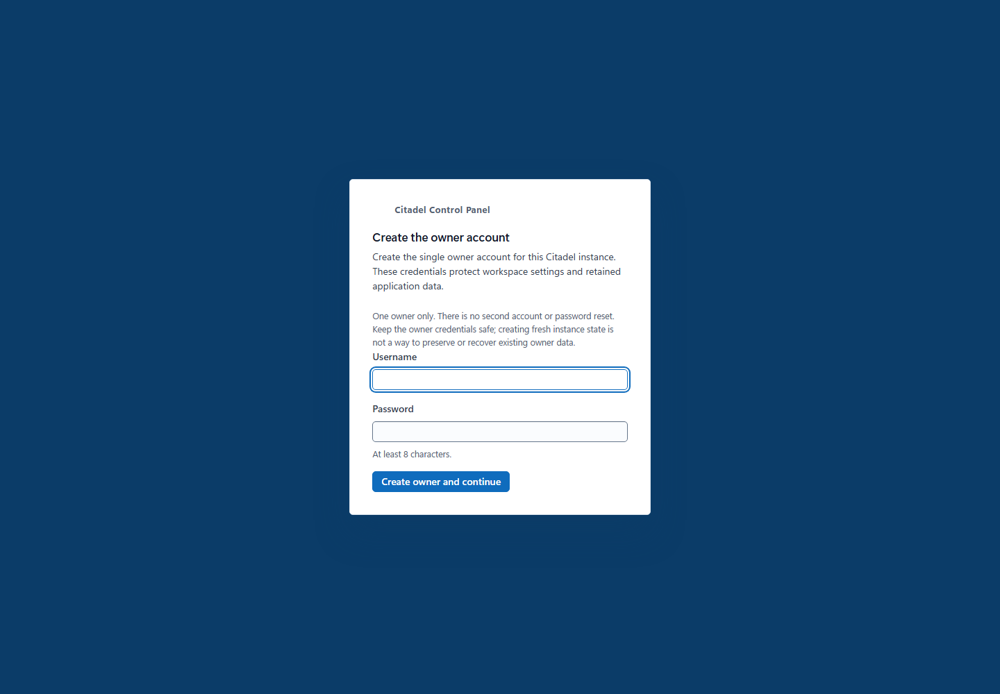

There is no second user and no password reset. Signing in is what issues the
session token every other request uses, so reaching the URL is not on its own
enough to use the application.

---

## Workspaces

A workspace is one Citadel repository. It can be a folder on this machine, or a
GitHub repository on a branch you choose. Attached workspaces are listed and open
in one click.

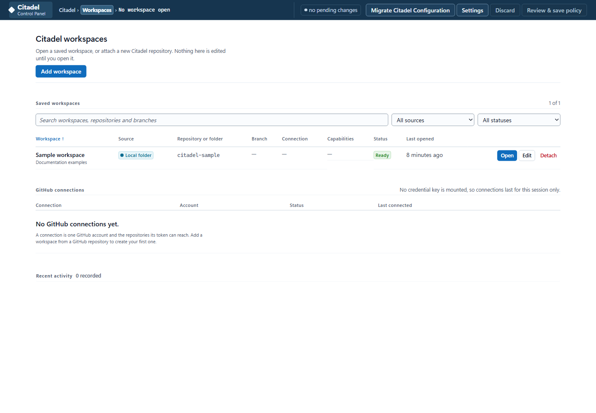

Adding one is a guided sequence. Nothing is read until the repository is confirmed
to carry the capabilities the editors need — an incomplete tree is rejected by
name rather than half-opened.

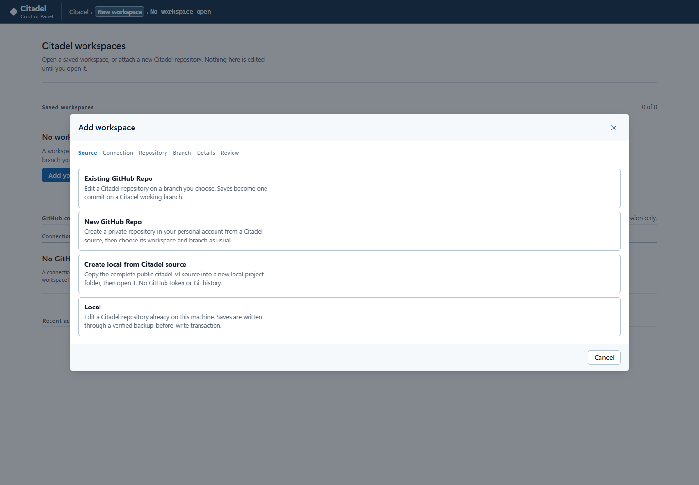

A **local folder** is granted through the browser's folder picker; the handle stays
in the browser profile, because it cannot be moved into a container. A **GitHub
repository** needs a fine-grained token with Contents read and write, limited to
the repositories it should reach. Saves become one commit on a working branch.

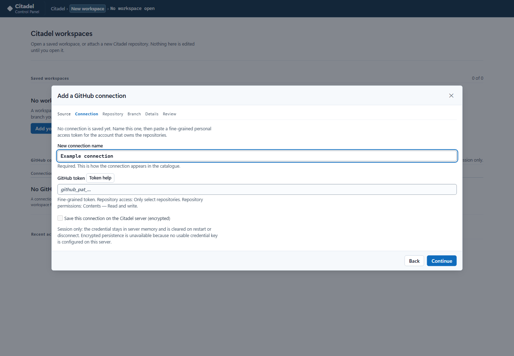

### Add a GitHub token

Choose **Add workspace** (or **Add your first workspace**), then **GitHub
repository**. If connections already exist, choose **Add a new connection**.
Enter a **New connection name** first to enable the **GitHub token** field, paste
your fine-grained personal access token, and select **Continue**. Choose a
repository and explicitly select its branch, such as `main`.

**Token help** beside the token label expands inline creation steps and a link
to GitHub, without clearing your entries. It is available before you name the
connection and when replacing a token through **Reconnect**.

Create the token in GitHub's **Settings > Developer settings > Personal access
tokens > Fine-grained tokens**. Select the intended resource owner and
**Only select repositories**, with **Contents: Read and write**.
**Metadata: Read-only** is included automatically. Classic tokens and the OAuth
token returned by `gh auth token` are not accepted.

Leave other permissions unset: Pull requests, Actions, Workflows and
administration permissions are not needed. Contents read-only cannot create
branches or save edits; Citadel does not offer a read-only workspace mode.
If the organization requires approval, a pending token can only read public
resources until an organization owner approves it.

Enter the token only in the UI, not in `container.env`, a Compose file, or an Azure
parameter file. Local-folder workspaces do not need a GitHub token.

The default local deployment has no credential key mounted. This disables only
**Persist this connection on this device (encrypted)**, not token entry or
GitHub access. Session-only connections work normally; after a container restart,
use **Reconnect** on the saved connection and supply a token for the same account.

These permissions apply to editable workspaces. Reading an older GitHub source
for migration needs only Contents read access, as described below.

---

## Migrate Citadel Configuration

Open the **current destination workspace**, then choose **Migrate Citadel
Configuration** in its command bar. The older repository is a read-only source:
it does not need to pass current workspace compatibility checks and is not
attached as another editable workspace. The destination's current parameter
names and templates remain authoritative.

### Source

Choose **Local folder**, **Parameter files**, or **GitHub repository**.

| Source | Access |
| --- | --- |
| Local folder | Read-only browser permission for the currently checked-out files |
| Parameter files | Explicit `.bicepparam` files or strict ARM deployment-parameters JSON; selected `.bicep` files can provide source schema metadata |
| Public GitHub | **GitHub access > Public repository (anonymous)**; no PAT |
| Private GitHub | **GitHub access > Personal access token** or **Saved GitHub connection** |

For a source PAT, select only the repository to read and grant **Contents:
Read-only**; **Metadata: Read-only** is automatic. Write, Administration, Actions,
and all-repository access are not required. **Token help** links to GitHub's token
creation page. A pasted source token is session-only and is cleared from the
form on submission. Reusing a saved connection creates a separate source session
without replacing or signing out the destination connection.

Select **Connect source** for a PAT, or **Use source connection** for a saved
connection. Enter the repository root URL, use **Find repository**, and explicitly
choose a branch, tag, or full commit SHA before **Read GitHub source**. A URL ending
in `/tree/main` must be entered as the repository root plus the separate `main`
branch field. The default branch is shown as metadata, not selected automatically.
Local folder selection reads files already on disk; it does not check out a branch.

### Files and mapping

In **Files**, choose a migration area, one current destination parameter file,
and the source parameter files to compare. Deployment, APIM Upgrade, Supporting
Services Upgrade, LLM Onboarding, and Access Contracts are separate areas.
Select an existing Access Contract instance explicitly; similarly named contracts
are never paired automatically.

Choose **Inspect mapping**. Names match using Bicep's case-insensitive identifier
rules, preserving the destination's casing. Only current names can receive values;
legacy-only parameters are never introduced. Each source/current file pair reports
its old-only names, or **None** when there are none, without exposing unused values.
Duplicate candidates remain separate for review rather than being resolved by
file order.

Review each proposed value against the current type, constraints, and feature
guidance before accepting it. Keeping current values preserves defaults for fields
not supplied by the source. Expressions, references, sensitive values, unsupported
schemas, and incompatible types remain unresolved rather than being evaluated or
coerced. Matching names do not prove that feature behavior or meaning is unchanged.

### Review and apply

Choose **Preview draft & report** to inspect the sanitized diff. **Download report**
and **Download sanitized draft** do not write either repository. The draft omits
sensitive and unresolved expression values; it is a manual handoff, not a
deployment-ready replacement file.

For a local destination, **Review & apply locally** asks for explicit confirmation
and uses the normal backup, verification, and rollback transaction. Pending editor
work, changed files or schemas, a moved GitHub source ref, or a switched workspace
invalidate the plan rather than overwriting newer work. Source repositories are
never written. GitHub destinations remain **preview/local-export-only**, even
when the ordinary workspace connection has write permission.

Use **Review another file** for another area or file pair. Separate name reports
remain available in the wizard, including after an apply; **Download all per-file
name reports** saves that history before closing. Changing or leaving an
authenticated source erases its source session. If erasure cannot be confirmed,
retry the reported cleanup instead of assuming the token has been removed.

Migration does not run deployment or upgrade scripts, clone Access Contract
policies, or translate resource outputs between upgrade files. For exact target
paths, supported formats, limits, and the pinned older `main` sample, see the
[migration reference](../CitadelUI/README.md#migrate-citadel-configuration).

---

## The three areas

Everything the gateway is operated through falls into three areas, shown down the
left. Every other parameter file in the repository stays reachable under **All
parameter files**.

| Area | Edits | Answers |
| --- | --- | --- |
| Azure Deployment | `bicep/infra/main.bicepparam` | How the hub itself is built |
| LLM Onboarding | `llm-backend-onboarding/main.bicepparam` | Which models sit behind the gateway |
| Access Contracts | One folder per contract | Who may use them, and under what limits |

---

## Azure Deployment

The hub's own parameters, grouped into the sections the file already declares:
Basics, Features, Resources, Networking, Inference logs, Compute and Accelerator.

### Feature flags turn capabilities on and off

Each flag decides whether a capability is deployed at all. Turning one off does not
merely hide it — the resources behind it are not created, and the parameters that
belong only to it stop being asked for.

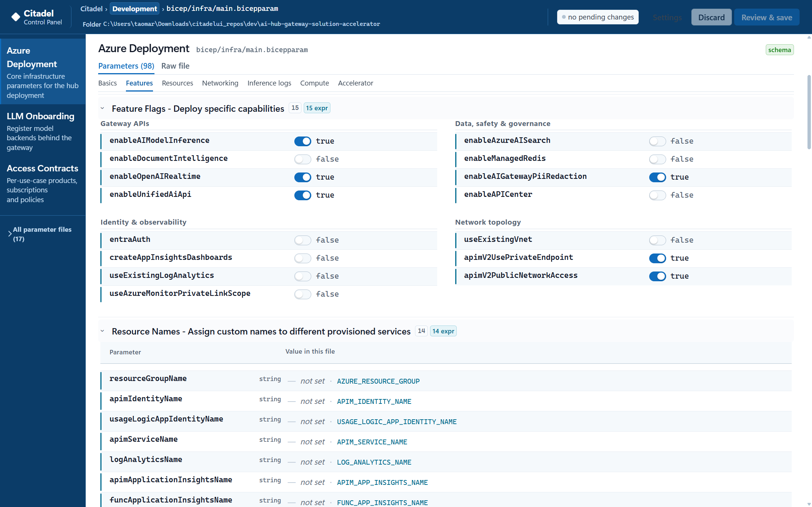

The flags are grouped by what they affect: gateway APIs such as model inference,
document intelligence and realtime; data, safety and governance such as AI Search,
managed Redis, PII redaction and API Center; identity and observability such as
Entra authentication and Application Insights dashboards; and network topology.

A disabled capability hides only the inputs proven exclusive to it by the Bicep
module graph. Shared settings, and any unsaved edits that depend on them, stay
visible rather than vanishing with unsaved work inside them.

### Networking understands the address plan

Address fields are checked when you leave the control, against Azure's own rules
rather than a regular expression.

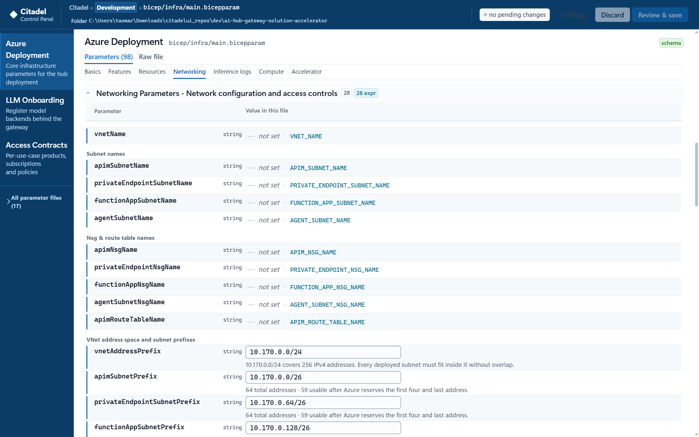

Each prefix reports what it actually buys — `64 total addresses · 59 usable after
Azure reserves the first four and last address` — so an undersized subnet is
visible before deployment rather than after it.

Subnets are checked against one another. An overlap is named precisely, on both
fields involved, and blocks the save:

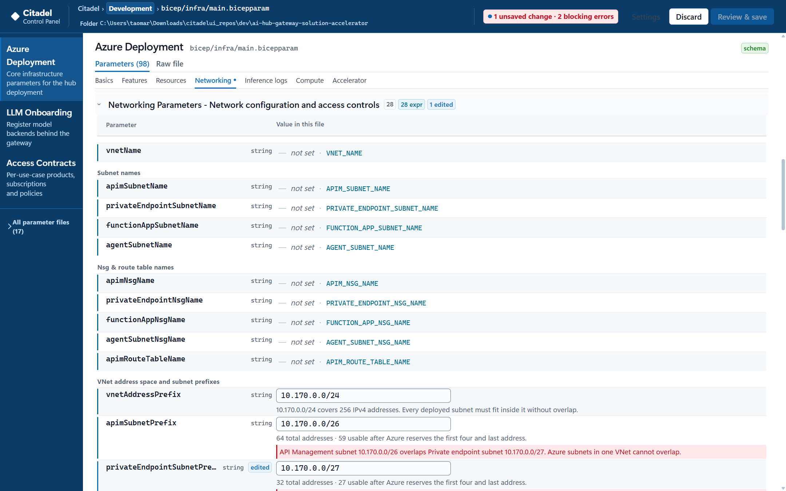

The header keeps a running count of blocking errors, and **Review & save** stays
disabled while any remain. The same checks cover malformed and non-canonical
CIDRs, ranges Azure prohibits, subnets that fall outside the VNet, unsupported
prefix sizes, and insufficient capacity for the services and private endpoints
that must fit inside them.

---

## LLM Onboarding

Everything about the models behind the gateway: the API Management instance they
are registered on, the managed identity used to reach them, the backends
themselves, circuit breaking, session affinity and model aliases.

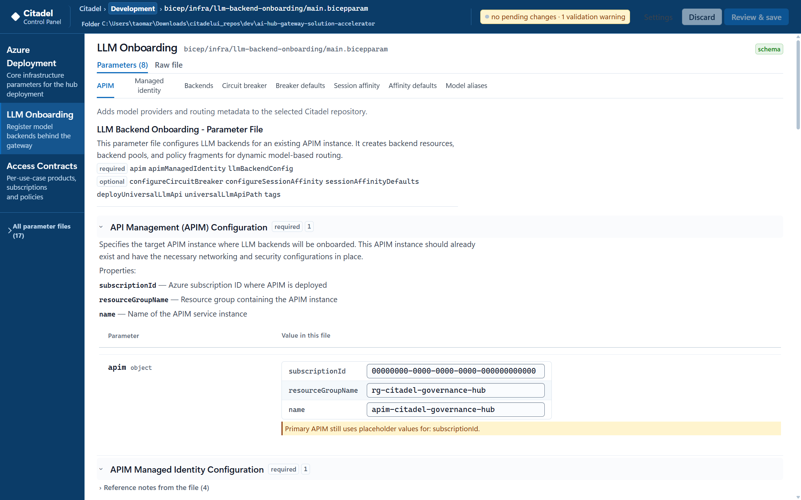

`llmBackendConfig` is an untyped array in Bicep, which means the compiler cannot
help you and neither can a generic form. It gets a purpose-built editor instead.

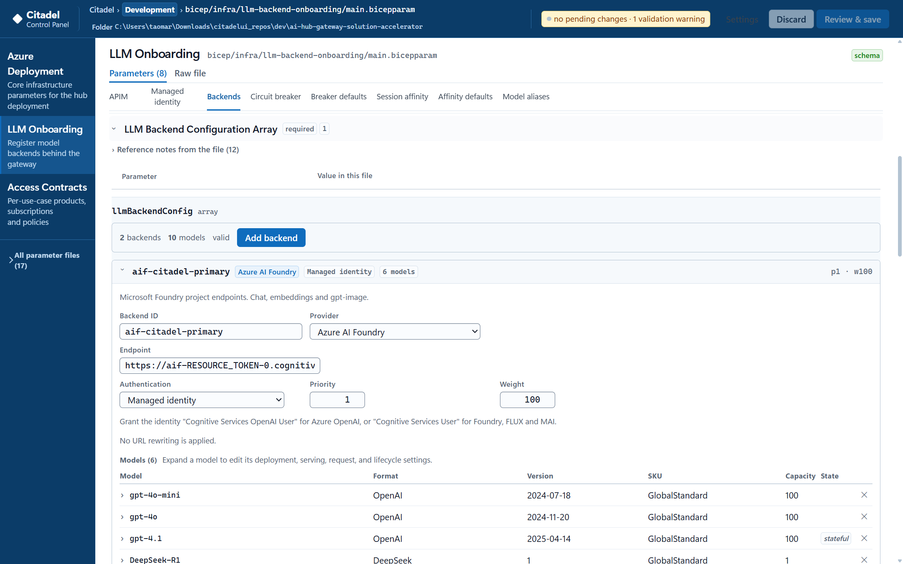

Each backend names its provider, endpoint and authentication mode. The editor
knows the default authentication mode for each provider type, shows the derived
default, lets you override it, and asks for a named value or Key Vault URI only
when the chosen mode actually needs one. Plain-text secrets are flagged.

Priority and weight control routing between backends. Adding a model offers the
models known to work with that provider, rather than requiring the exact string
from memory.

---

## Access Contracts

One contract is one use case: a product, its subscriptions, and the API Management
policy that constrains it. Each is a folder holding a parameter file and its own
policy document, created from a template and then edited independently.

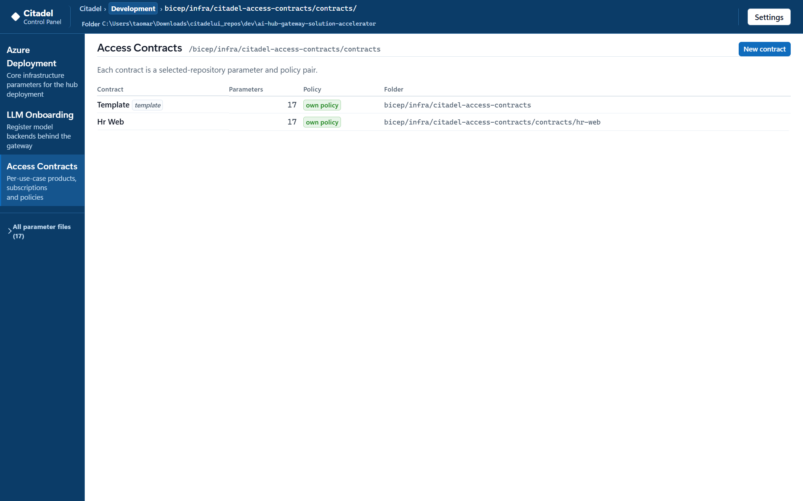

Opening one gives its parameters, its policy, and the raw file.

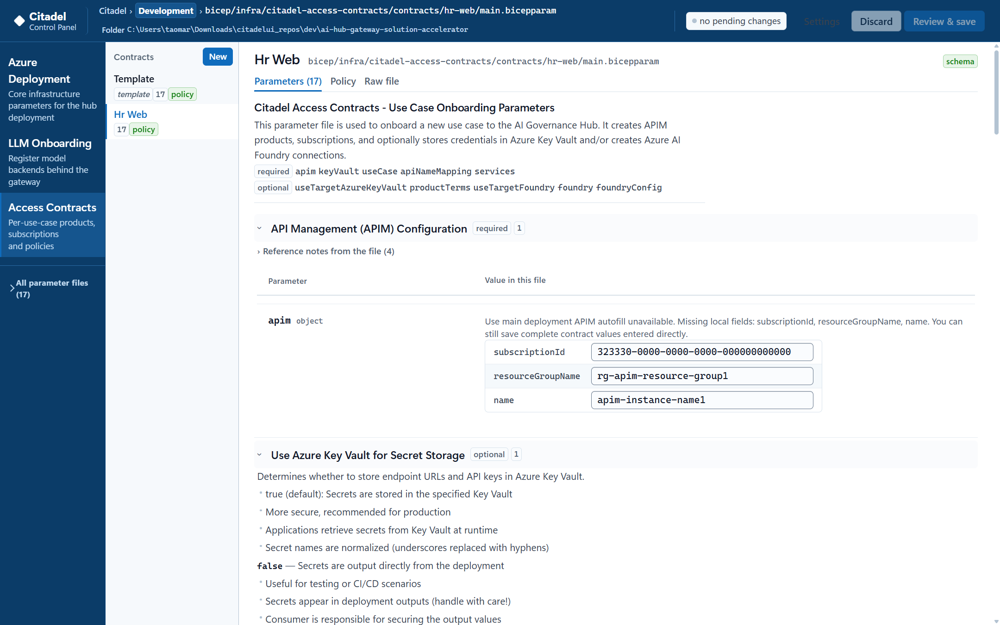

### Editing the policy

The policy is API Management XML. The editor presents it as the blocks it is
actually made of, each of which can be switched on or off, with the raw XML always
one click away.

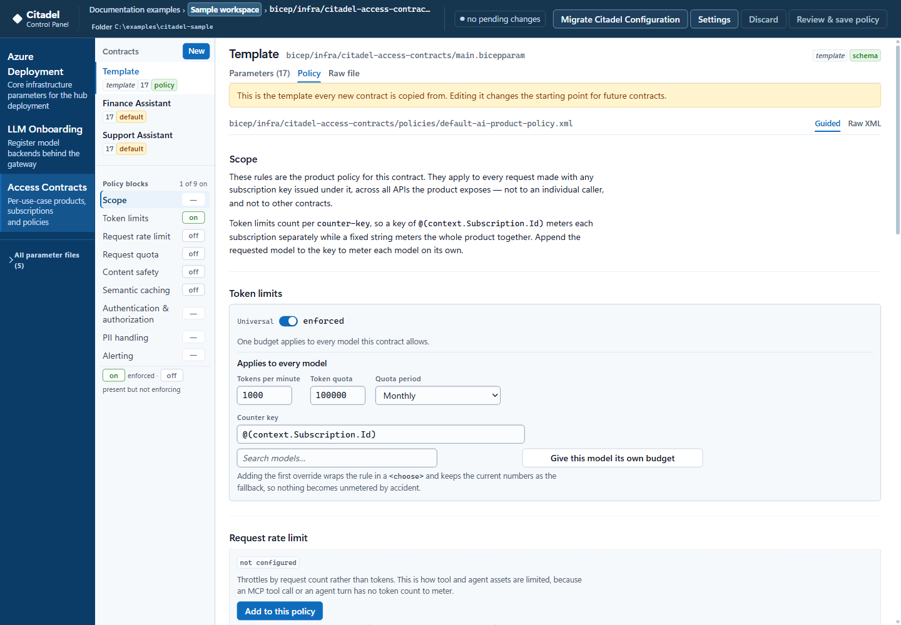

Scope, allowed models, token limits, request rate limits, quotas, content safety,
semantic caching, authentication, PII handling, alerting, response headers and
policy fragments each appear as a block. The header shows how many are active.

The editor checks the policy against the rest of the repository, not just against
itself. A model allowed here that has not been onboarded in LLM Onboarding is
flagged by name — a mistake that would otherwise surface as a runtime rejection
long after the deployment succeeded.

---

## Reviewing and saving

Edits accumulate as pending changes. The header shows how many there are and
whether anything blocks the save.

**Review & save** shows what will be written before it is written. On confirmation
the browser backs up every target, writes, verifies the resulting hashes, and
restores from the verified backup bytes if any part fails. A failed multi-file
write leaves the repository as it was.

For a GitHub workspace, a save becomes one commit on a working branch you choose.
For a local folder it is written through the same verified transaction directly to
disk.

**Discard** abandons every pending change without touching the repository.

Each save appends a redacted, hash-chained entry to the activity log, reachable
from the landing page.
